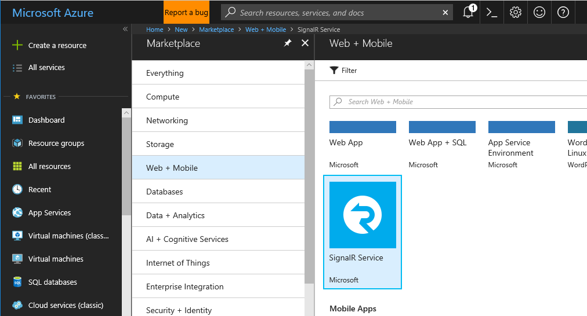
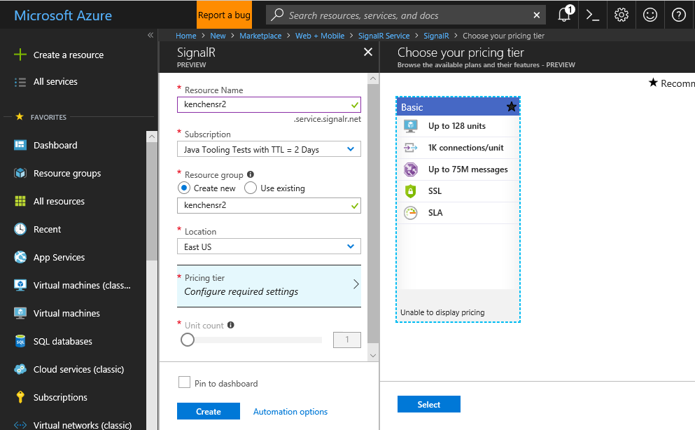
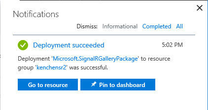

# Build Your First Azure SignalR Service Application for ASP.NET SignalR

In [ChatRoomLocal sample](../ChatRoomLocal) you have learned how to use SignalR to build a chat room application. In that sample, the SignalR runtime (which manages the client connections and message routing) is running on your local machine. As the number of the clients increases, you'll eventually hit a limit on your machine and you'll need to scale up your machine to handle more clients. This is usually not an easy task. In this tutorial, you'll learn how to use Azure SignalR Service to offload the connection management part to the service so that you don't need to worry about the scaling problem.

## Provision a SignalR Service

First let's provision a SignalR service on Azure.

1. Open Azure portal, click "Create a resource" and find "SignalR Service" in "Web + Mobile".

   

2. Click "Create", and then fill in basic information including resource name, resource group and location.

   

   Resource name will also be used as the DNS name of your service endpoint. So you'll get a `<resource_name>.service.signalr.net` that your application can connect to.

   Select a pricing tier. There're two pricing tiers:
   
   * Free: which can handle 20 connections at the same time and can send and receive 20,000 messages in a day.
   * Standard: which has 1000 concurrent connections and one million messages per day limit for *one unit*. You can scale up to 100 units for a single service instance and you'll be charged by the number of units you use.

3. Click "Create", your SignalR service will be created in a few minutes.

   

After your service is ready, go to the **Keys** page of your service instance and you'll get two connection strings that your application can use to connect to the service.

## Update Chat Room to Use Azure SignalR Service

Then, let's update the chat room sample to use the new service you just created.

Let's look at the key changes:

1.  In [Startup.cs](Startup.cs), instead of calling `MapSignalR()`, you need to call `MapAzureSignalR({your_applicationName})` and pass in connection string to make the application connect to the service instead of hosting SignalR by itself. Replace `{YourApplicationName}` to the name of your application, this is the unique name to distinguish this application with your other application. You can use `this.GetType().FullName` as the value.

    ```cs
    public void Configuration(IAppBuilder app)
    {
        // Any connection or hub wire up and configuration should go here
        app.MapAzureSignalR(this.GetType().FullName);
    }
    ```

    You also need to reference the service SDK before using these APIs. Open the **Tools | Library Package Manager | Package Manager Console** and run command:

    ```powershell
    Install-Package Microsoft.Azure.SignalR.AspNet
    ```

    Other than these changes, everything else remains the same, you can still use the hub interface you're already familiar with to write business logic.

    > Under the hood, an endpoint `/signalr/negotiate` is exposed for negotiation by Azure SignalR Service SDK. It will return a special negotiation response when clients try to connect and redirect clients to service endpoint from the connection string.

2. Now set the connection string in the web.config file.

    ```xml
    <configuration>
        <connectionStrings>
            <add name="Azure:SignalR:ConnectionString" connectionString="{Replace By Your Connection String}"/>
        </connectionStrings>
    ...
    </configuration>
    ```

Press **F5** to run the project in debug mode. You can see the application runs as usual, just instead of hosting a SignalR runtime by itself, it connects to the SignalR service running on Azure.

In this sample, you have learned how to use Azure SignalR Service to replace your self-hosted SignalR runtime.
