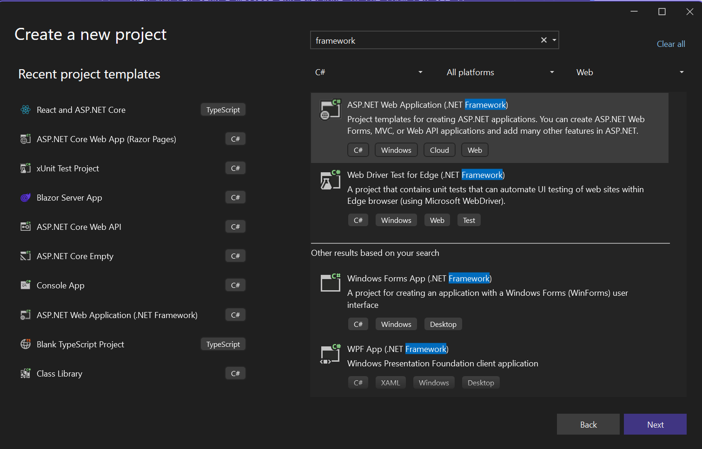
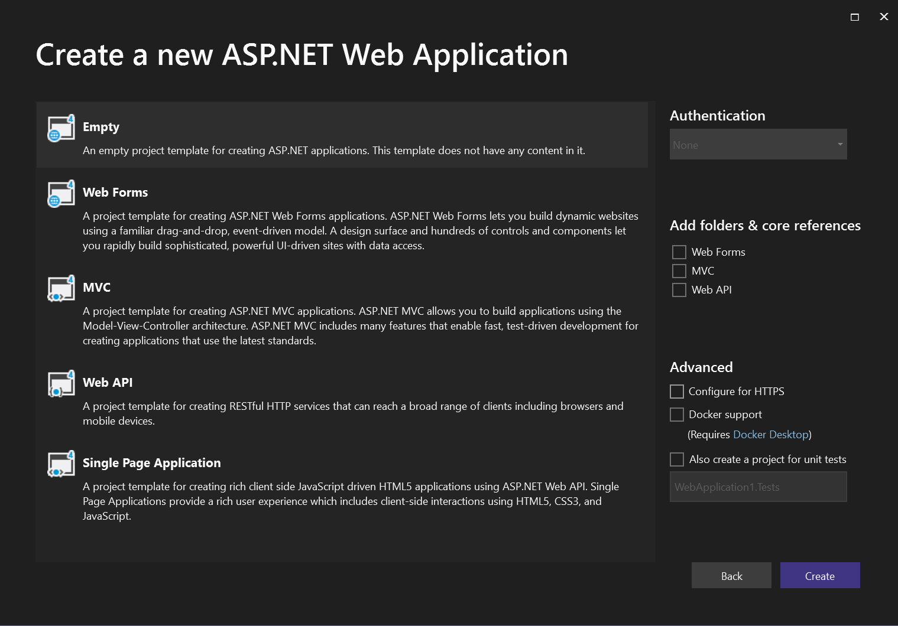
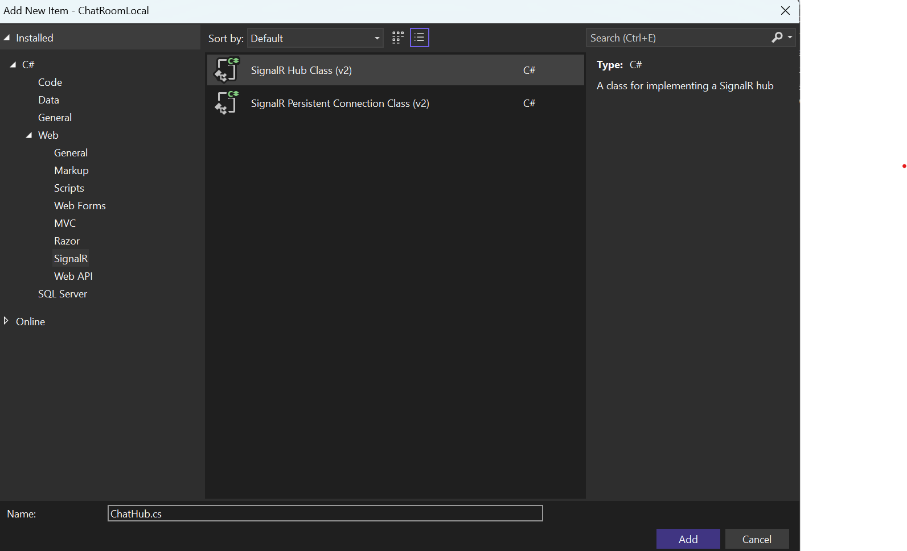

# Get Started with ASP.NET SignalR: a Chat Room Example

In this sample you'll learn how to use ASP.NET SignalR to build a chat room application.

> This tutorial is to give you a brief introduction about how ASP.NET SignalR works, if you're already familiar with it, you can skip this sample.
>
> Please be noted this sample is based on the ASP.NET version. You can find detailed tutorials talking about ASP.NET SignalR in [SignalR Docs Site](https://docs.microsoft.com/en-us/aspnet/signalr/).

Our chat room is a web page application that anyone can login to and chat with other users in the room.

When you open the application you'll be asked for your name:


Then you can send a message and everyone in the room can see it:


> Prerequisites
> * [Visual Studio 2017](https://visualstudio.microsoft.com/downloads/)
> * .NET 4.6.1
> * SignalR version 2.4.0

Let's implement this feature step by step.

1. In Visual Studio, create an ASP.NET Web Application

    

2. In the **New ASP.NET Project** window, leave **Empty** selected and click **Create** Project.

    
 
3. Open the **Tools | Library Package Manager | Package Manager Console** and run command:

    ```powershell
    Install-Package Microsoft.AspNet.SignalR
    ```

4. In **Solution Explorer**, right-click the project, select **Add | SignalR Hub Class (v2)**. Name the class **ChatHub.cs** and add it to the project. This step creates the **ChatHub** class and adds to the project a set of script files and assembly references that support SignalR.

    

5. Replace the code in the new **ChatHub** class with the following code.

    ```csharp
    using System;
    using System.Web;
    using Microsoft.AspNet.SignalR;
    namespace ChatRoom
    {
        public class ChatHub : Hub
        {
            public void Send(string name, string message)
            {
                // Call the broadcastMessage method to update clients.
                Clients.All.broadcastMessage(name, message);
            }
        }
    }
    ```

6. In **Solution Explorer**, right-click the project, then click **Add | OWIN Startup Class**. Name the new class `Startup` and click OK.

    

7. Change the connects of the new `Startup` class to the following.

    ```csharp
    using System;
    using System.Threading.Tasks;
    using Microsoft.Owin;
    using Owin;

    [assembly: OwinStartup(typeof(ChatRoom.Startup))]

    namespace ChatRoom
    {
        public class Startup
        {
            public void Configuration(IAppBuilder app)
            {
                // Any connection or hub wire up and configuration should go here
                app.MapSignalR();
            }
        }
    }
    ```

8. In **Solution Explorer**, right-click the project, then click **Add | HTML Page**. Name the new page `index.html`.

    > Note
    >
    > You might need to change the version numbers for the references to JQuery and SignalR libraries

9. Replace the default code in the HTML page with the following code.

    > Note
    >
    > A later version of the SignalR scripts may be installed by the package manager. Verify that the script references below correspond to the versions of the script files in the project

    ```html
    <!DOCTYPE html>
    <html>
    <head>
        <title>SignalR Simple Chat</title>
        <style type="text/css">
            .container {
                background-color: #99CCFF;
                border: thick solid #808080;
                padding: 20px;
                margin: 20px;
            }
        </style>
    </head>
    <body>
        <div class="container">
            <input type="text" id="message" />
            <input type="button" id="sendmessage" value="Send" />
            <input type="hidden" id="displayname" />
            <ul id="discussion"></ul>
        </div>
        <!--Script references. -->
        <!--Reference the jQuery library. -->
        <script src="Scripts/jquery-1.6.4.min.js"></script>
        <!--Reference the SignalR library. -->
        <script src="Scripts/jquery.signalR-2.4.3.js"></script>
        <!--Reference the autogenerated SignalR hub script. -->
        <script src="signalr/hubs"></script>
        <!--Add script to update the page and send messages.-->
        <script type="text/javascript">
            $(function () {
                // Declare a proxy to reference the hub.
                var chat = $.connection.chatHub;
                // Create a function that the hub can call to broadcast messages.
                chat.client.broadcastMessage = function (name, message) {
                    // Html encode display name and message.
                    var encodedName = $('<div />').text(name).html();
                    var encodedMsg = $('<div />').text(message).html();
                    // Add the message to the page.
                    $('#discussion').append('<li><strong>' + encodedName
                        + '</strong>:&nbsp;&nbsp;' + encodedMsg + '</li>');
                };
                // Get the user name and store it to prepend to messages.
                $('#displayname').val(prompt('Enter your name:', ''));
                // Set initial focus to message input box.
                $('#message').focus();
                // Start the connection.
                $.connection.hub.start().done(function () {
                    $('#sendmessage').click(function () {
                        // Call the Send method on the hub.
                        chat.server.send($('#displayname').val(), $('#message').val());
                        // Clear text box and reset focus for next comment.
                        $('#message').val('').focus();
                    });
                });
            });
        </script>
    </body>
    </html>
    ```

10. **Save All** for the project.

11. Press **F5** to run the project in debug mode. The HTML page loads in a browser instance and prompts for a user name. Enter a name to start a simple chat. Copy the URL from the address line of the browser and use it to open two more browser instances. In each browser instance, enter a unique user name. In each browser instance, add a comment and click Send. The comments should display in all browser instances.

12. If you are interested in how the sample works, you can refer to [Tutorial: Getting Started with SignalR 2](https://docs.microsoft.com/en-us/aspnet/signalr/overview/getting-started/tutorial-getting-started-with-signalr#examine-the-code) for a detailed code walk through.

In this sample you have learned the basics of SignalR and how to use it to build a chat room application.
In other samples you'll learn how to use Azure SignalR service and host your chat room on Azure.
