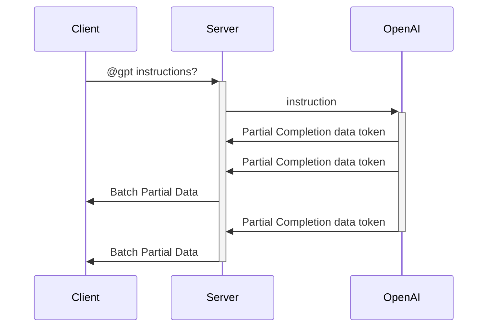

# AI Streaming with SignalR

## Introduction

In the current landscape of digital communication, AI-powered chatbots and streaming technology have become increasingly popular.
This project aims to combine these two trends into a seamless group chat application by leveraging SignalR for real-time communication and integrating ChatGPT.
This project demonstrates SignalR group chats and ChatGPT integration.

## Features

- Group Chat Functionality: Users can create or join groups and participate in a shared chat experience.
- AI Integration: Users can interact with an AI chatbot by using the @gpt command, seamlessly integrating AI responses into the group chat.
- Real-Time Streaming: The application supports real-time message streaming, ensuring that all participants receive updates instantly.

## Build and Run

### Prerequisites

- [.NET 8.0](https://dotnet.microsoft.com/download/dotnet/8.0)
- Azure OpenAI or OpenAI

### Steps

- Edit `appsettings.json` and update the `Endpoint` and `Key` to be the endpoint and key of your Azure OpenAI instance. Find how to get endpoint and key [here](https://learn.microsoft.com/azure/ai-services/openai/chatgpt-quickstart?tabs=command-line%2Cpython-new&pivots=programming-language-csharp#retrieve-key-and-endpoint).
Update the `model` to your deployment name of Azure OpenAI.

- Edit `Azure.SignalR.ConnectionString` in `appsettings.json` to the connection string of Azure SignalR Service. For the security concern, we suggest using
identity based connection string.

```
Endpoint=xxx;AuthType=azure
```

And then you need to grant your user the `SignalR App Server ` role. For more connection string details, please access to [Connection String](https://learn.microsoft.com/en-us/azure/azure-signalr/concept-connection-string), and for more details about permission, please access to [Assign Azure roles for access rights](https://learn.microsoft.com/azure/azure-signalr/signalr-concept-authorize-azure-active-directory#assign-azure-roles-for-access-rights).


Run the project with:

```bash
dotnet run
```

Open your browser and navigate to http://localhost:5000 to see the application in action.


### Use OpenAI instead of Azure OpenAI

You can also use OpenAI instead of Azure OpenAI with some minor changes.

1. Update the `appsettings.json`:

```json
"OpenAI": {
    "Endpoint": null, // Leave it null
    "key": "<key from openai>",
    "Model": "gpt-4o"
}
```

2. Update the `Program.cs`:

```csharp
builder.Services.AddSingleton<GroupAccessor>()
                .AddSingleton<GroupHistoryStore>()
//                .AddAzureOpenAI(builder.Configuration); // Comment this line and add the below line
                .AddOpenAI(builder.Configuration);
```

## How It Works

### 1. Group Chat

When a user sends a message in the chat, it is broadcast to all other members of the group using SignalR. If the message does not contain the `@gpt` prefix, it is treated as a regular message, stored in the group’s chat history, and use `Clients.OthersInGroup(groupName).SendAsync()` to send to all connected users.

### 2. AI Interaction and Streaming

If a message begins with @gpt, the application interprets it as a request to involve the AI chatbot powered by OpenAI. Below are some key details on how this interaction works.

#### Roles in chat completion

The OpenAI Chat Completions API supports three distinct roles for generating responses: assistant, user, and system.

- The assistant role stores previous AI responses.
- The user role contains requests or comments by users.
- The system role sets the guidelines for how the AI should respond.

In this project, the system role is pre-configured to instruct the AI to act as a group chat assistant. This configuration, located in the GroupHistoryStore.cs file, ensures the AI responds in a manner that is friendly, knowledgeable, and contextually relevant to the ongoing group conversation.

```csharp
new SystemChatMessage("You are a friendly and knowledgeable assistant participating in a group discussion." +
                " Your role is to provide helpful, accurate, and concise information when addressed." +
                " Maintain a respectful tone, ensure your responses are clear and relevant to the group's ongoing conversation, and assist in facilitating productive discussions." +
                " Messages from users will be in the format 'UserName: chat messages'." +
                " Pay attention to the 'UserName' to understand who is speaking and tailor your responses accordingly."),
```

All the messages from the user are in the `user` role, with the format `UserName: chat messages`.


#### History content

To enable the OpenAI model to generate context-aware responses, the chat history of the group is provided to the model. This history is managed by the GroupHistoryStore class, which maintains and updates the chat logs for each group.

Both the user’s messages and the AI’s responses are stored in the chat history, with user messages labeled under the user role and AI responses under the assistant role. These history entries are then sent to the OpenAI model as a `IList<string>`.

```csharp
// GroupChatHub.cs
chatClient.CompleteChatStreamingAsync(messagesIncludeHistory)
```

#### Workflow

When a user sends a message starting with `@gpt`, the application sends the message together with the whole history to the OpenAI API for completion. The AI model generates a response based on the user's input and the group's chat history.

The application uses the streaming capabilities of OpenAI to progressively send the AI's response back to the client as it is generated. The response is buffered and sent in chunks whenever the accumulated content exceeds a specific length, making the AI interaction feel more responsive.


