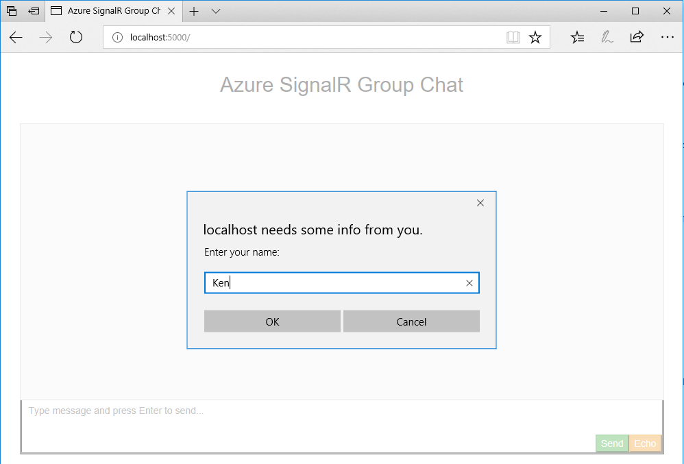

# Get Started with SignalR: a Chat Room Example

In this sample you'll learn how to use ASP.NET Core SignalR to build a chat room application.

> This tutorial is to give you a brief introduction about how ASP.NET Core SignalR works, if you're already familiar with it, you can skip this sample.
>
> Please be noted this sample (and all other samples in this repo) is based on ASP.NET Core SignalR rather than the ASP.NET version.

Our chat room is a web page application that anyone can login and chat with others in the room.

First time you open the application you'll be asked for your name:



Then send something and everyone in the room can see it:


Let's do it step by step.

1.  First create a ASP.NET Core web application.

    ```
    dotnet new web
    ```

    > Before you start, make sure you installed [.NET Core SDK](https://www.microsoft.com/net/learn/get-started).

2.  Create a `Chat.cs` that defines a `Chat` hub class.

    ```cs
    using Microsoft.AspNetCore.SignalR;

    public class Chat : Hub
    {
        public void BroadcastMessage(string name, string message)
        {
            Clients.All.SendAsync("broadcastMessage", name, message);
        }

        public void Echo(string name, string message)
        {
            Clients.Client(Context.ConnectionId).SendAsync("echo", name, message + " (echo from server)");
        }
    }
    ```

    > You need to reference the SignalR SDK before using the APIs:
    >
    > ```xml
    > <PackageReference Include="Microsoft.AspNetCore.SignalR" Version="1.0.0-rc1-final" />
    > ```

    Hub is the core concept in SignalR which exposes a set of methods that can be called from client. Here we define two methods: `Broadcast()` which broadcasts the message to all clients and `Echo()` which sends the message back to the caller.

    In each method you can see there is a `Clients` interface that gives you access to all connected clients so you can directly call back to these clients.

3.  Then we need to initialize SignalR runtime when the application starts up. Add the following in `Startup.cs`:

    ```cs
    public void ConfigureServices(IServiceCollection services)
    {
        services.AddSignalR();
    }

    public void Configure(IApplicationBuilder app)
    {
        ...
        app.UseSignalR(routes =>
        {
            routes.MapHub<Chat>("/chat");
        });
    }
    ```

    The key changes here are `AddSignalR()` which initialize SignalR runtime and `MapHub()` which maps the hub to `/chat` so clients can access the hub using this url.

4.  The last step is to create the UI of the chat room. In this sample, we use HTML and javascript to build a web application.

    Copy the HTML and script files from [wwwroot](wwwroot/) of the sample project to the `wwwroot` folder of your project.
    Add the following code to `Startup.cs` to make the application serve the pages:

    ```cs
    public void Configure(IApplicationBuilder app, IHostingEnvironment env)
    {
        ...
        app.UseFileServer();
    }
    ```

    Let's take a look at key changes in [index.html](wwwroot/index.html). First it creates a hub connection to the server:

    ```js
    var connection = new signalR.HubConnectionBuilder()
                                .withUrl('/chat')
                                .build();
    ```

    When user clicks send button, it calls `broadcastMessage()` to broadcast the message to other clients:

    ```js
    document.getElementById('sendmessage').addEventListener('click', function (event) {
        // Call the broadcastMessage method on the hub.
        if (messageInput.value) {
            connection.send('broadcastMessage', username, messageInput.value);
        }
        ...
    });
    ```

    Also it registers a callback to receive message from server:

    ```js
    var messageCallback = function(name, message) {
        if (!message) return;
        // Html encode display name and message.
        var encodedName = name;
        var encodedMsg = message.replace(/&/g, "&amp;").replace(/</g, "&lt;").replace(/>/g, "&gt;");
        var messageEntry = createMessageEntry(encodedName, encodedMsg);

        var messageBox = document.getElementById('messages');
        messageBox.appendChild(messageEntry);
        messageBox.scrollTop = messageBox.scrollHeight;
    };
    // Create a function that the hub can call to broadcast messages.
    connection.on('broadcastMessage', messageCallback);
    ```

Now build and run the application:

```
dotnet build
dotnet run
```

Open http://localhost:5000, you'll see the chat room running on your local machine.

In this sample you have learned the basics of SignalR and how to use it to build a chat room application.
In other samples you'll learn how to use Azure SignalR service and host your chat room on Azure.
