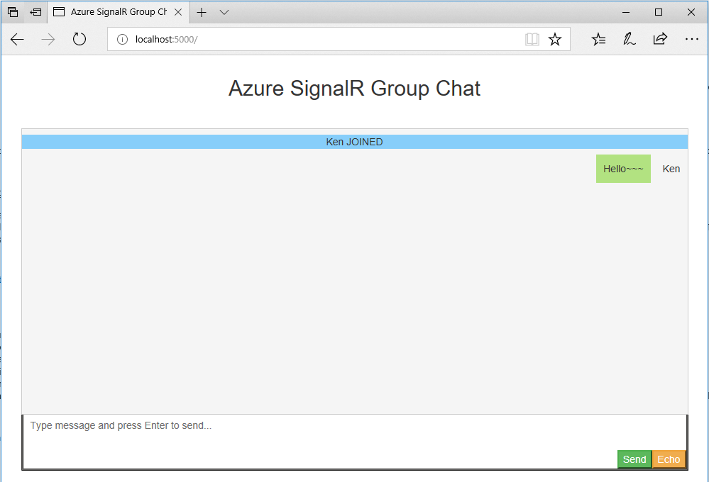

# Get Started with SignalR: a Chat Room Example

In this sample you'll learn how to use ASP.NET Core SignalR to build a chat room application.

> This tutorial is to give you a brief introduction about how ASP.NET Core SignalR works, if you're already familiar with it, you can skip this sample.
>
> Please be noted this sample, and all other samples in this repo, are based on ASP.NET Core SignalR rather than the ASP.NET version.

Our chat room is a web page application that anyone can login to and chat with other users in the room.

The first time you open the application you'll be asked for your name:


Then you can send a message and everyone in the room can see it:



Let's implement this feature step by step.

1.  First create a ASP.NET Core web application.

    ```
    dotnet new web
    ```

    > Before you start, make sure you installed the latest [.NET Core 7.0 SDK](https://dotnet.microsoft.com/download/dotnet-core/7.0).

2.  Create a `ChatSampleHub.cs` that defines a `Chat` hub class.

    ```cs
    using Microsoft.AspNetCore.SignalR;

    public class ChatSampleHub : Hub
    {
        public Task BroadcastMessage(string name, string message) =>
            Clients.All.SendAsync("broadcastMessage", name, message);

        public Task Echo(string name, string message) =>
            Clients.Client(Context.ConnectionId)
                    .SendAsync("echo", name, $"{message} (echo from server)");
    }
    ```

    > SignalR feature is already *available* as part of the `Microsoft.AspNetCore.App` shared framework.

    Hub is the core concept in SignalR which exposes a set of methods that can be called from clients. Here we define two methods: `BroadcastMessage()` which broadcasts the message to all clients and `Echo()` which sends the message back to the caller.

    In each method you can see there is a `Clients` interface that gives you access to all connected clients so you can directly call back to these clients.

3.  Then we need to initialize the SignalR runtime when the application starts up. Update `Program.cs` to the following:

    ```cs
    var builder = WebApplication.CreateBuilder(args);
    builder.Services.AddSignalR();
    var app = builder.Build();

    app.UseRouting();
    app.MapHub<ChatSampleHub>("/chat");
    app.Run();
    ```

    The key changes here are `AddSignalR()` which initializes the SignalR runtime and `MapHub()` which maps the hub to the `/chat` endpoint so clients can access the hub using this url.

4.  The last step is to create the UI of the chat room. In this sample, we will use HTML and Javascript to build a web application:

    Copy the HTML and script files from [wwwroot](wwwroot/) of the sample project to the `wwwroot` folder of your project.
    Add the following code to `Program.cs` above `app.UseRouting()` to make the application serve the pages:

    ```cs
    ...
    app.UseDefaultFiles();
    app.UseStaticFiles();
    app.UseRouting();
    ...
    
    ```

    Let's take a look at key changes in [index.html](wwwroot/index.html). First it creates a hub connection to the server:

    ```js
    var connection = new signalR.HubConnectionBuilder()
                                .withUrl('/chat')
                                .build();
    ```

    When the user clicks the send button, it calls `broadcastMessage()` to broadcast the message to other clients:

    ```js
    document.getElementById('sendmessage').addEventListener('click', function (event) {
        // Call the broadcastMessage method on the hub.
        if (messageInput.value) {
            connection.send('broadcastMessage', username, messageInput.value);
        }
        ...
    });
    ```

    Also, it registers a callback to receive messages from the server:

    ```js
    var messageCallback = function(name, message) {
        if (!message) return;
        // Html encode display name and message.
        var encodedName = name;
        var encodedMsg = message.replace(/&/g, "&amp;").replace(/</g, "&lt;").replace(/>/g, "&gt;");
        var messageEntry = createMessageEntry(encodedName, encodedMsg);

        var messageBox = document.getElementById('messages');
        messageBox.appendChild(messageEntry);
        messageBox.scrollTop = messageBox.scrollHeight;
    };
    // Create a function that the hub can call to broadcast messages.
    connection.on('broadcastMessage', messageCallback);
    ```

Now, let's run run the application:

```
dotnet run
```

> You can also use `dotnet watch run` to watch and reload the code changes.

Open http://localhost:5000, and you'll see the chat room running on your local machine.

In this sample you have learned the basics of SignalR and how to use it to build a chat room application.
In other samples you'll learn how to use Azure SignalR service and host your chat room on Azure.
