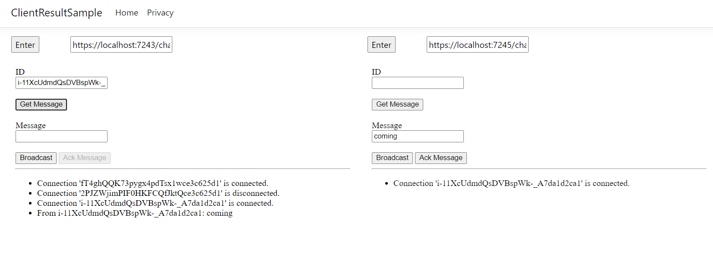

# Example app that makes use of SignalR Client Invocation

This sample provides regular function `Broadcast` and new feature `Client Invocation` supported in NET7.0.

## Prerequisites

* Requires NET7.0 Preview7 or later SDK/Runtime. Please installed from https://dotnet.microsoft.com/download/dotnet/7.0.
* Requires SDK `Microsoft.Azure.SignalR` version >= 1.19.0-preview1-11052. [Myget](https://www.myget.org/feed/azure-signalr-dev/package/nuget/Microsoft.Azure.SignalR) | [Nuget](https://www.nuget.org/packages/Microsoft.Azure.SignalR)
* Require an [Azure SignalR Service resource](https://learn.microsoft.com/azure/azure-signalr/signalr-quickstart-dotnet-core#create-an-azure-signalr-resource) with a connection string. 

## Usage

1. Set the connection string in the [Secret Manager tool](https://learn.microsoft.com/aspnet/core/security/app-secrets?view=aspnetcore-7.0&tabs=windows#secret-manager) for .NET Core, and run this app.

    ```bash
    dotnet restore
    dotnet user-secrets set Azure:SignalR:ConnectionString "<your connection string>"
    ```

2. Confirm you're installing correct package.

    ```bash
    dotnet list package
    ```

    Expected resolved package version is greater than `1.19.0-preview1-11052`.

    ```
    [net7.0]:
    Top-level Package              Requested               Resolved
    > Microsoft.Azure.SignalR      1.*                     1.19.0
    ```

3. If not, run command to explictly install the package.

    ```bash
    dotnet add package Microsoft.Azure.SignalR --version 1.19.0-preview1-11052 --source https://www.myget.org/F/azure-signalr-dev/api/v3/index.json
    ```

4. Start the app

    ```bash
    dotnet run
    ```



### Using client invocation

1. Browse to the site with your favorite browser and it will connect with the SignalR Javascript client.
2. It creates 2 clients by default. Grab an ID from the connected connections and paste it in the ID text box.
3. Press 'Get Message' to invoke a Hub method which will ask the specified ID for a result.
4. The client invoked will unlock 'Ack Message' button and you can type something in the text box above.
5. Press 'Ack Message' to return the message to the server which will return it to the original client that asked for a result.

### Using client invocation with multiple servers

1. Run `dotnet run` to start default profile and will serve under `https://localhost:7243`. Skip this step if you didn't stop it yet.
2. Open another bash window, run `dotnet run --launch-profile Server1` to start another server and will serve under `https://localhost:7245`.
3. Browse the default server site under `https://localhost:7243`.
4. In any of the iframe update the url to second server chats page `https://localhost:7245/chats` to access from second server.
5. Press 'Enter' to access. Now you're able to test clients on different servers.

### Using broadcast

1. Browse to the site with your favorite browser and it will connect with the SignalR Javascript client.
2. It creates 2 clients by default.
3. Enter some messages in the text box above 'Broadcast'.
4. Press 'Broadcast' to send message to all connected clients.

### Using client invoation from anywhere with `IHubContext`

1. Browse to the site with your favorite browser and it will connect with the SignalR Javascript client.
2. Copy the ID for a connected connection.
3. Navigate to `/get/<ID>` in a new tab. Replace `<ID>` with the copied connection ID.
5. Go to the browser tab for the chosen ID and write a message in the Message text box.
6. Press 'Ack Message' to return the message to the server which will return it to the `/get/<ID>` request.
