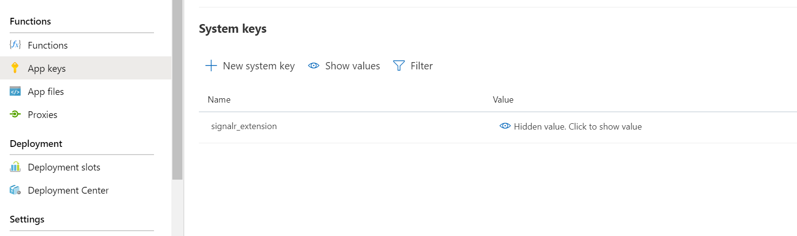
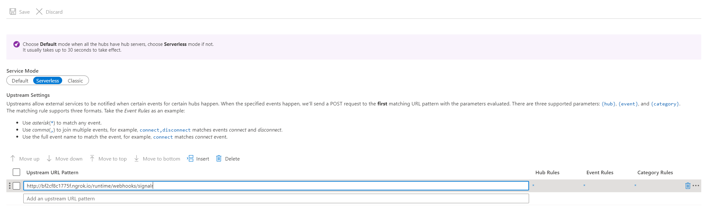
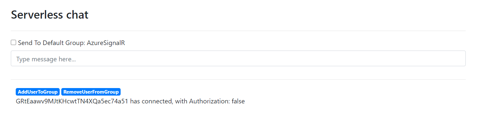
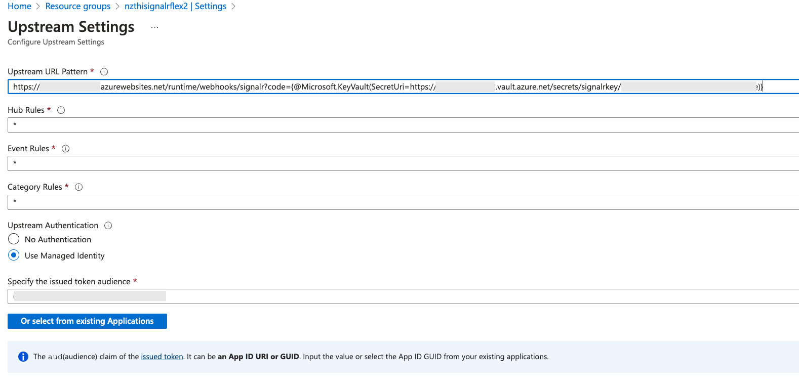
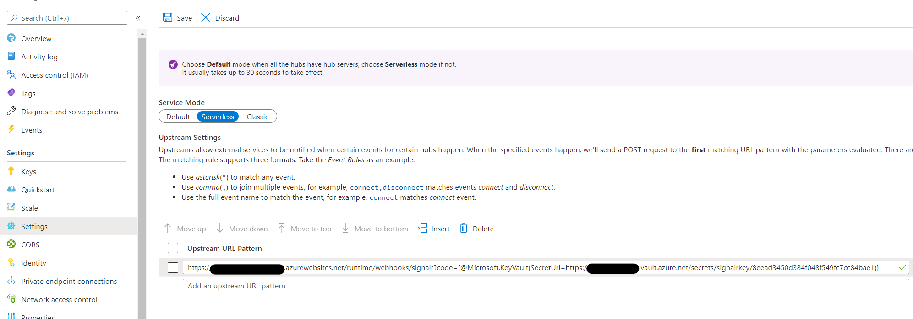
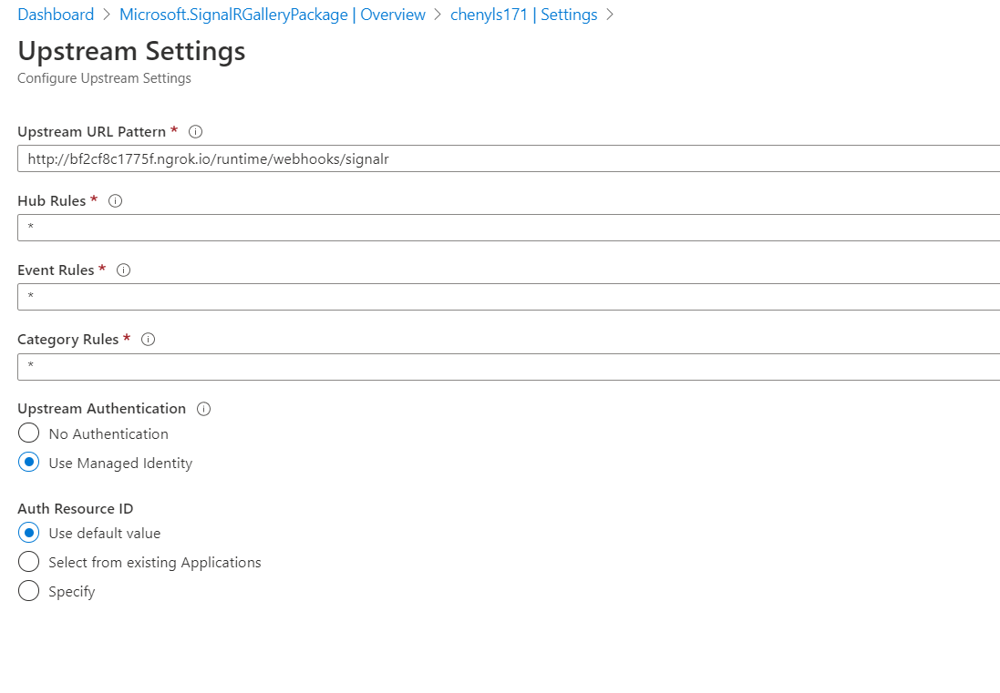
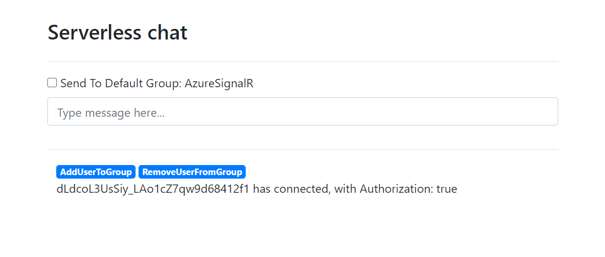

# Azure function bidirectional chatroom sample

This is a chatroom sample that demonstrates bidirectional message pushing between Azure SignalR Service and Azure Functions in a serverless scenario. It leverages the [**upstream**](https://docs.microsoft.com/azure/azure-signalr/concept-upstream) provided by Azure SignalR Service that features proxying messages from client to upstream endpoints in serverless scenario. Azure Functions with SignalR trigger binding allows you to write code to receive and push messages in several languages, including JavaScript, Python, C#, etc.

  - [Prerequisites](#prerequisites)
  - [Run sample in Azure](#run-sample-in-azure)
    - [Create Azure SignalR Service](#create-azure-signalr-service)
    - [Deploy project to Azure Function](#deploy-project-to-azure-function)
    - [Use a chat sample website to test end to end](#use-a-chat-sample-website-to-test-end-to-end)
  - [Use Key Vault secret reference](#use-key-vault-secret-reference)
  - [Enable AAD Token on upstream](#enable-aad-token-on-upstream)

<a name="prerequisites"></a>

## Prerequisites

The following are required to build this tutorial.
* [.NET SDK](https://dotnet.microsoft.com/download) (Version 8.0, required for Functions extensions)
* [Azure Functions Core Tools](https://docs.microsoft.com/azure/azure-functions/functions-run-local?tabs=windows%2Ccsharp%2Cbash#install-the-azure-functions-core-tools) (Version 4.0.5907 or newer)
* [Azure CLI](https://docs.microsoft.com/cli/azure/install-azure-cli?view=azure-cli-latest) (Version 2.63.0 or newer)

<a name="run-sample-in-azure"></a>

## Run sample in Azure

You will create an Azure SignalR Service and an Azure Function app to host the sample. And you will launch chatroom locally but connecting to Azure SignalR Service and Azure Function.

### Create Azure SignalR Service

1. Create Azure SignalR Service using `az cli`

    ```bash
    resourceGroup=myResourceGroup
    signalrName=mySignalRName
    region=eastus

    # Create a resource group.
    az group create --name $resourceGroup --location $region

    az signalr create -n $signalrName -g $resourceGroup --service-mode Serverless --sku Standard_S1
    # Get connection string for later use.
    connectionString=$(az signalr key list -n $signalrName -g $resourceGroup --query primaryConnectionString -o tsv)
    ```

    For more details about creating Azure SignalR Service, see the [tutorial](https://docs.microsoft.com/en-us/azure/azure-signalr/signalr-quickstart-azure-functions-javascript#create-an-azure-signalr-service-instance).

### Deploy and configure project to Azure Function

1. Deploy with Azure Functions Core Tools
    1. [Install Azure Functions Core Tools](https://docs.microsoft.com/en-us/azure/azure-functions/functions-run-local?tabs=windows%2Ccsharp%2Cbash#install-the-azure-functions-core-tools)
    2. [Create a Flex Consumption Azure Function App](https://learn.microsoft.com/en-us/azure/azure-functions/flex-consumption-how-to?tabs=azure-cli%2Cvs-code-publish&pivots=programming-language-csharp) (code snippet shown below). This sample can also be used with other Azure Functions hosting plans.

        ```bash
        #!/bin/bash

        # Function app and storage account names must be unique.
        storageName=mystorageaccount
        functionAppName=myserverlessfunc

        # Create an Azure storage account in the resource group.
        az storage account create \
        --name $storageName \
        --location $region \
        --resource-group $resourceGroup \
        --sku Standard_LRS

        # Create a serverless function app in the resource group.
        az functionapp create \
        --name $functionAppName \
        --storage-account $storageName \
        --flexconsumption-location $region \
        --resource-group $resourceGroup \
        --runtime dotnet-isolated
        ```
    3. Update application settings

        ```bash
        az functionapp config appsettings set --resource-group $resourceGroup --name $functionAppName --setting AzureSignalRConnectionString=$connectionString
        ```
        
    4. Publish the sample to the Azure Function you created before.

        ```bash
        cd <root>/samples/DotnetIsolated-ClassBased
        // If prompted function app version, use --force
        func azure functionapp publish $functionAppName --dotnet-isolated
        ```

2. Update Azure SignalR Service Upstream settings

    Open the Azure Portal and nevigate to the Function App created before. Find `signalr_extension` key in the **App keys** blade.

    

    Copy the `signalr_extensions` value and use Azure Portal to set the upstream setting.
    - In the *Upstream URL Pattern*, fill in the `<function-url>/runtime/webhooks/signalr?code=<signalr_extension-key>`
        > [!NOTE]
        > The `signalr_extensions` code is required by Azure Function but the trigger does not only use this code but also Azure SignalR Service connection string to validate requests. If you're very serious about the code, use KeyVault secret reference feature to save the code. See [Use Key Vault secret reference](#use-keyvault-secret-reference).

        

### Use a chat sample website to test end to end

1. Use browser to visit `<function-app-url>/api/index` for the web page of the demo.

2. Try send messages by entering them into the main chat box.
    

## Use Key Vault secret reference

The url of upstream is not encrypted at rest. If you have any sensitive information, you can use Key Vault to save this sensitive information. Basically, you can enable managed identity of Azure SignalR Service and then grant a read permission on a Key Vault instance and use Key Vault reference instead of plaintext in `Upstream URL Pattern`.

The following steps demonstrate how to use Key Vault secret reference to save `signalr_extensions`.

1. Enable managed identity.

    1. Enable managed identity with system assigned identity.

        Open portal and navigate to **Identity**, and switch to **System assigned** page. Switch **Status** to **On**.

        

2. Create a Key Vault instance.

    ```bash
    az keyvault create --name "<your-unique-keyvault-name>" --resource-group "myResourceGroup" --location "EastUS"
    ```

3. Save `signalr_extensions` to secret.

    ```bash
    az keyvault secret set --name "signalrkey" --vault-name "<your-unique-keyvault-name>" --value "<signalr_extension_code_copied_from_azure_function>"
    ```

4. Grant **Secret Read** permission to the Key Vault.

    ```bash
    az keyvault set-policy --name "<your-unique-keyvault-name>" --object-id "<object-id-shown-in-system-assigned-identity>" --secret-permissions get
    ```

5. Get the secret identity of the secret.

    ```bash
    az keyvault secret show --name "signalrkey" --vault-name "<your-unique-keyvault-name>" --query id -o tsv
    ```

6. Update **Upstream URL Pattern** with Key Vault reference. You need to follow the syntax `{@Microsoft.KeyVault(SecretUri=<secret-identity>)}`. As shown below:

    

## Enable AAD Token on upstream

You can set **ManagedIdentity** as the **Auth** setting in upstream. After that, SignalR Service will set an AAD Token into the `Authorization` for each upstream request.

1. Make sure you have enabled managed identity.

2. Click the asterisk in *Hub Rules* and a new page pops out as shown below.
    

3. Select *Use Managed Identity* under *Upstream Authentication* and choose the system identity created earlier for the SignalR service. 

4. Use browser to visit `<function-app-url>/api/index` for the web page of the demo

5. Try send messages by entering them into the main chat box. You can verify the `Authorization` has set from the `with Authorization: true`
    