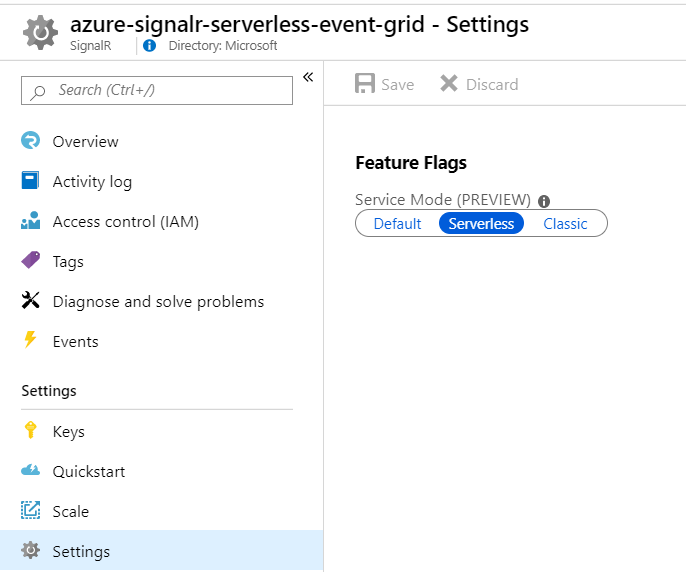
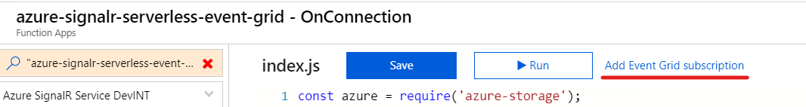
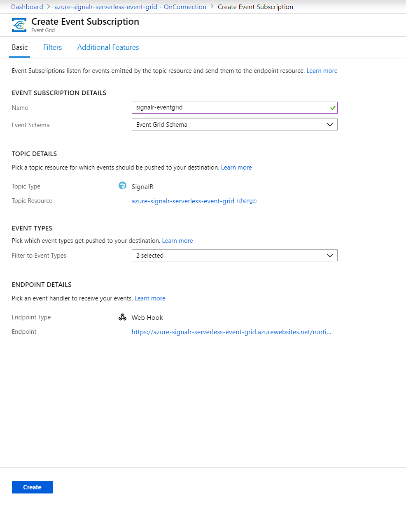
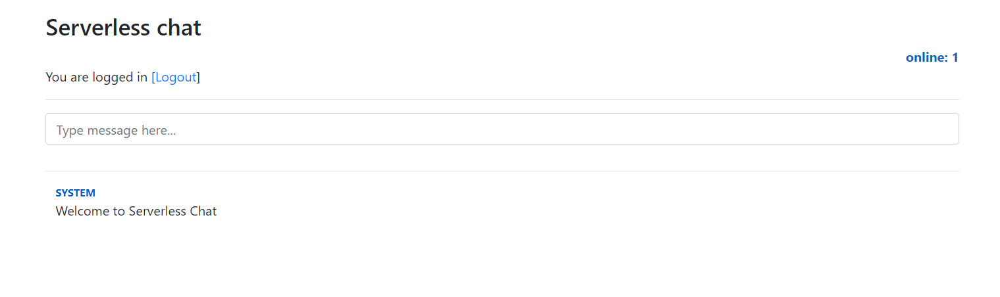
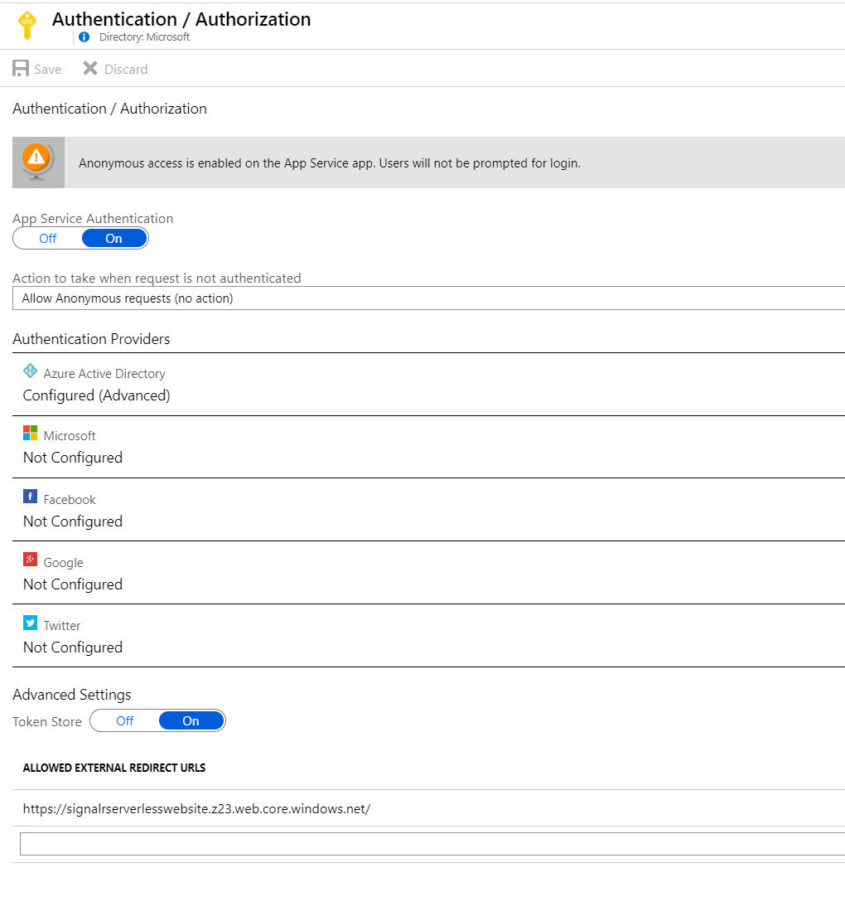
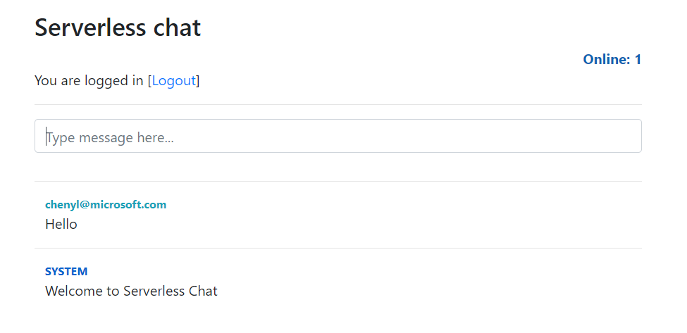

# Sample: Azure SignalR Service integration with Event Grid and Azure Function

A step by step tutorial to build a chat room with real-time online counting using Azure Functions, Event Grid, App Service Authentication, and SignalR Service.

- [Prerequisites](#prerequisites)
- [Initialize the function app](#initialize-function-app)
- [Deploy and run function app on Azure](#deploy-to-azure)
- [Enable authentication on Azure](#enable-authentication)
- [Build the sample locally](#build-locally)

<a name="prerequisites"></a>
## Prerequisites

The following softwares are required to build this tutorial.

* [Node.js](https://nodejs.org/en/download/) (Version 10.x, required for JavaScript sample)
* [.NET SDK](https://www.microsoft.com/net/download) (Version 6.0, required for Functions extensions)
* [Azure Functions Core Tools](https://github.com/Azure/azure-functions-core-tools) (Version 4)
* [Azure CLI](https://docs.microsoft.com/en-us/cli/azure/install-azure-cli?view=azure-cli-latest)

### Create an Azure SignalR Service instance

No matter you want to build and test the Azure Functions app on Azure or locally. The app will access a SignalR Service instance in Azure that needs to be created ahead of time.

1. Create Azure SignalR Service using `az cli`

    ```bash
    az signalr create -n <signalr-name> -g <resource-group-name> --sku Free_F1
    ```

    For more details about creating Azure SignalR Service, see the [tutorial](https://docs.microsoft.com/en-us/azure/azure-signalr/signalr-quickstart-azure-functions-javascript#create-an-azure-signalr-service-instance).

1. After the instance is deployed, open it in the portal and locate its `Settings` page. Change the Service Mode setting to **Serverless**.

    

### Create a Storage account

An Azure Storage account is required by a function app using Event Grid trigger. You will also host the web page for the chat UI using the static websites feature of Azure Storage if you try to deploy the application to Azure.

- Create a storage with kind `StorageV2` using `az cli`

    ```bash
     az storage account create -n <storage-account-name> -g <resource-group-name> -l <location> --sku Standard_LRS --kind StorageV2
    ```

<a name="initialize-function-app"></a>
## Initialize the function app

- Git clone the project and open the folder with VS Code

    ```bash
    git clone git@github.com:aspnet/AzureSignalR-samples.git
    ```

- In the repository, there're two Event Grid integration samples using different languages. For the JavaScript sample, navigate to

    ```bash
    AzureSignalR-samples/samples/EventGridIntegration/javascript
    ```

- If you want to use C# sample, navigate to

    ```bash
    AzureSignalR-samples/samples/EventGridIntegration/csharp
    ```

### Configure application settings

When running and debugging the Azure Functions runtime locally, application settings are read from **local.settings.json**. Also, you can upload there settings to remote when you try to deploy Function App to Azure. Update this file with the connection string of the SignalR Service instance that you created earlier.

1. Open the file **local.settings.json** and update the settings. (The file shown below is used by JavaScript sample, and the C# sample is similar)

    ```json
    {
      "IsEncrypted": false,
      "Values": {
        "AzureSignalRConnectionString": "<signalr-connection-string>",
        "WEBSITE_NODE_DEFAULT_VERSION": "10.14.1",
        "FUNCTIONS_WORKER_RUNTIME": "node",
        "AzureWebJobsStorage": "<Azure-storage-connection-string>",
        "AZURE_STORAGE_CONNECTION_STRING": "<Azure-storage-connection-string>"
      },
      "Host": {
        "LocalHttpPort": 7071,
        "CORS": "http://127.0.0.1:5500",
        "CORSCredentials": true
      }
    }
    ```

   - Replace `AzureSignalRConnectionString` with Azure SignalR Service connection string. Obtain the value from the **Keys** page in the Azure SignalR Service resource in the Azure portal; either the primary or secondary connection string can be used.

        

   - Replace `AzureWebJobsStorage` and `AZURE_STORAGE_CONNECTION_STRING` with connection string of storage created previously. `AzureWebJobsStorage` is used by Event Grid trigger and the `AZURE_STORAGE_CONNECTION_STRING` is used by storage client in codes.

1. Save the file.

1. Open the VS Code command palette (`Ctrl-Shift-P`, macOS: `Cmd-Shift-P`) and select **Azure Functions: Initialize Project for Use with VSCode**.

1. Open the terminal and run `func extensions install` to install all the dependencies.

<a name="deploy-to-azure"></a>
## Deploy and run function app on Azure

### Deploy function app to Azure

1. In the VS Code, install the [Azure Functions Extension](https://marketplace.visualstudio.com/items?itemName=ms-azuretools.vscode-azurefunctions).

1. Open the VS Code command palette (`Ctrl-Shift-P`, macOS: `Cmd-Shift-P`) and select **Azure Functions: Deploy to Function App**.

1. When prompted, provide the following information.

    | Name | Value |
    |---|---|
    | Folder to deploy | Select the main project folder |
    | Subscription | Select your subscription |
    | Function app | Select **Create New Function App** |
    | Function app name | Enter a unique name |
    | Resource group | Select the same resource group as the SignalR Service instance |
    | Storage account | Select the storage account you created earlier |

    A new function app is created in Azure and the deployment begins. Wait for the deployment to complete.

### Upload function app local settings

1. Open the VS Code command palette (`Ctrl-Shift-P`, macOS: `Cmd-Shift-P`).

1. Search for and select the **Azure Functions: Upload local settings** command.

1. When prompted, provide the following information.

    | Name | Value |
    |---|---|
    | Local settings file | local.settings.json |
    | Subscription | Select your subscription |
    | Function app | Select the previously deployed function app |

    Local settings are uploaded to the function app in Azure. If prompted to overwrite existing settings, select **Yes to all**.

### Configure static websites

We use **Static Website** to host the web page. Find the [document](https://docs.microsoft.com/en-us/azure/storage/blobs/storage-blob-static-website) for more details.

1. Enable the static website feature

    ```bash
    az storage blob service-properties update --account-name <storage-account-name> --static-website --index-document index.html
    ```

1. Get the url of function app

    ```bash
    hostname=$(az functionapp show -n <function-app-name> -g <resource-group-name> -o tsv --query defaultHostName)
    ```

    Replace the `apiBaseUrl` in `index.html` with the url `https://$(hostname)`

    Upload the `index.html` to Azure Storage

    ```bash
    az storage blob upload-batch -s content -d '$web' --account-name <storage-account-name>
    ```

    Get the primary url of website and save it for future use.

    ```bash
    az storage account show -n <storage-account-name> -g <resource-group-name> --query "primaryEndpoints.web" --output tsv
    ```

### Subscribe Azure SignalR events

Subscribe to Azure SignalR OnConnected and OnDisconnected events and let Event Grid trigger be enabled.

1. Open the VS Code command palette (`Ctrl-Shift-P`, macOS: `Cmd-Shift-P`).

1. Search for and select the **Azure Functions: Open in portal** command.

1. Select the Function `OnConnection` in the left panel. After the function shown, click `Add Event Grid subscription` and choose the Azure SignalR Service.
    

1. Fill the page as shown below.
    

### Enable function app cross origin resource sharing (CORS)

Although there is a CORS setting in **local.settings.json**, it is not propagated to the function app in Azure. You need to set it separately.

1. Open the function app in the Azure portal.

1. Under the **Platform features** tab, select **CORS**.

1. In the *Allowed origins* section, add an entry with the static website *primary endpoint* as the value (remove the trailing */*).

1. In order for the SignalR JavaScript SDK call your function app from a browser, support for credentials in CORS must be enabled. Select the "Enable Access-Control-Allow-Credentials" checkbox.

1. Click **Save** to persist the CORS settings.

### Try the application

1. In a browser, navigate to the storage account's primary web endpoint.

1. When you're connected, the online connection count is shown and you will get a welcome message.

1. Send public messages by entering them into the main chat box.

    

<a name="enable-authentication"></a>
## Enable authentication on Azure

### Enable App Service Authentication

App Service Authentication supports authentication with Azure Active Directory, Facebook, Twitter, Microsoft account, and Google.

1. In the function app that was opened in the portal, locate the **Platform features** tab, select **Authentication/Authorization**.

1. Turn **On** App Service Authentication.

1. In **Action to take when request is not authenticated**, select "Allow Anonymous requests (no action)".

1. In **Allowed External Redirect URLs**, enter the URL of your storage account primary web endpoint that you previously noted.

1. Follow the documentation for the login provider of your choice to complete the configuration.

    - [Azure Active Directory](https://docs.microsoft.com/azure/app-service/configure-authentication-provider-aad)
    - [Facebook](https://docs.microsoft.com/azure/app-service/configure-authentication-provider-facebook)
    - [Twitter](https://docs.microsoft.com/azure/app-service/configure-authentication-provider-twitter)
    - [Microsoft account](https://docs.microsoft.com/azure/app-service/configure-authentication-provider-microsoft)
    - [Google](https://docs.microsoft.com/azure/app-service/configure-authentication-provider-google)

     

### Update the web app

1. Open **index.html** and update the value of `isAuthNeeded` to `true`.

1. The application can be configured with authentication using Azure Active Directory, Facebook, Twitter, Microsoft account, or Google. Select the authentication provider that you will use by setting the value of `authProvider`.

1. Use **Azure Storage: Deploy to Static Website** command to upload the **index.html** to Azure Storage

### Update negotiate function

1. Update the attribute parameter of negotiate function.

    - If you're using JavaScript sample, update in `userId` in `negotiate/function.json` to `"{headers.x-ms-client-principal-name}"`.

        ```json
        {
          "type": "signalRConnectionInfo",
          "name": "connectionInfo",
          "userId": "{headers.x-ms-client-principal-name}",
          "hubName": "EventGridIntegrationSampleChat",
          "direction": "in"
        }
        ```

    - If you're using C# sample, add parameter `UserId = "{headers.x-ms-signalr-userid}"` to `Negotiate` function.

        ```C#
        [SignalRConnectionInfo(HubName = HubName, UserId = "{headers.x-ms-signalr-userid}")] SignalRConnectionInfo connectionInfo
        ```

1. Deploy the function to Azure again

### Try the application with authentication

1. In a browser, navigate to the storage account's primary web endpoint.

1. Select **Login** to authenticate with your chosen authentication provider.

1. When you're connected, the online connection count is shown and you will get a welcome message.

1. Send public messages by entering them into the main chat box.

1. Send private messages by clicking on a username in the chat history. Only the selected recipient will receive these messages.

    

<a name="build-locally"></a>
## Build and run the sample locally

### Prerequisites

* [Live Server](https://marketplace.visualstudio.com/items?itemName=ritwickdey.LiveServer) - serve web pages locally for testing
* [ngrok](https://ngrok.com/) - Public URLs for exposing your local Event Grid trigger

### Create an ngrok endpoint

When running Event Grid trigger locally, you need a tool to proxy events to your local endpoint like [ngrok](https://ngrok.com/). For more details about running Event Grid trigger locally, go to the [document](https://docs.microsoft.com/en-us/azure/azure-functions/functions-debug-event-grid-trigger-local).

Download *ngrok.exe* from [ngrok](https://ngrok.com/), and run with the following command:

```
ngrok http -host-header=localhost 7071
```

The -host-header parameter is needed because the functions runtime expects requests from localhost when it runs on localhost. 7071 is the default port number when the runtime runs locally.

The command creates output like the following:

```
Session Status                online
Version                       2.2.8
Region                        United States (us)
Web Interface                 http://127.0.0.1:4040
Forwarding                    http://263db807.ngrok.io -> localhost:7071
Forwarding                    https://263db807.ngrok.io -> localhost:7071

Connections                   ttl     opn     rt1     rt5     p50     p90
                              0       0       0.00    0.00    0.00    0.00
```

You'll use the `https://{subdomain}.ngrok.io` URL for your Event Grid subscription.

### Run the Event Grid trigger function

The ngrok URL doesn't get special handling by Event Grid, so your function **must be running** locally when the subscription is created. If it isn't, the validation response doesn't get sent and the subscription creation fails.

### Create a subscription

Create an Event Grid subscription of SignalR Service, and give it your ngrok endpoint.

Use this endpoint pattern for Functions 2.x:

```
https://{SUBDOMAIN}.ngrok.io/runtime/webhooks/eventgrid?functionName={FUNCTION_NAME}
```

The `{FUNCTION_NAME}` parameter must be the name specified in the `FunctionName` attribute.

Here's an example to integrate with Azure SignalR Service using the Azure CLI:

```azurecli
az eventgrid event-subscription create --resource-id <signalr-service-resource-id> --name <event-grid-subscription-name> --endpoint https://263db807.ngrok.io/runtime/webhooks/eventgrid?functionName=OnConnection
```

## Run the client page and test

The chat application's UI is a simple single page application (SPA) created with the Vue JavaScript framework. It will be hosted separately from the function app. Locally, you will run the web interface using the Live Server VS Code extension.

1. Press **F5** to run the function app locally and attach a debugger.

1. With **index.html** open, start Live Server by opening the VS Code command palette (`Ctrl-Shift-P`, macOS: `Cmd-Shift-P`) and selecting **Live Server: Open with Live Server**. Live Server will open the application in a browser.
    - The `Host` section in **local.settings.json** configures the port and CORS settings for the local Functions host (this setting has no effect when running in Azure).

       > [!NOTE]
       > Live Server is typically configured to serve content from `http://127.0.0.1:5500`. If you find that it is using a different URL or you are using a different HTTP server, change the `CORS` setting to reflect the correct origin.

1. The application opens. You will get a welcome message from `Function` and real-time connected connection counting. Also, you can broadcast message in the chat sample.
