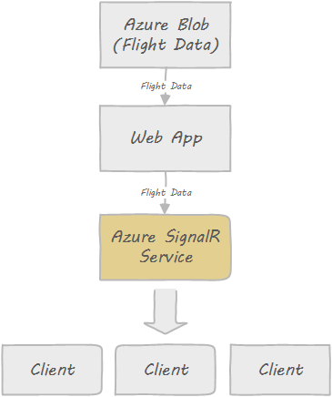

# Flight Map: Realtime Monitoring Dashboard using Azure SignalR Service

This sample shows how to use Azure SignalR Service to build a realtime monitoring dashboard. Open the application, you'll see flight locations in realtime.

A live demo can be found [here](http://flightmap-demo1.azurewebsites.net/).

## How Does It Work

In this sample, the data is generated on a web app, by reading from a JSON file on Azure blob. The web app then connects to the Azure SignalR Service and use it broadcast the data to all clients.

Here is a diagram that illustrates the application structure:



In real world scenarios you can replace the web server and the blob storage with a component that generates the real data.

## Deploy to Azure

1. Add your bing map key to `index.html`:

    ```
    <script src='https://www.bing.com/api/maps/mapcontrol?callback=getMap&key=<bing_map_key>'
    ```

1. Build docker image

    ```
    docker build -t flightmap .
    ```

1. Push the docker image to a docker registry such as DockHub or[Azure Container Registry](https://azure.microsoft.com/en-us/services/container-registry/). Below are the commands to push to Azure Container Registry.

    ```
    docker login <acr_name>.azurecr.io
    docker tag flightmap <acr_name>.azurecr.io/flightmap
    docker push <acr_name>.azurecr.io/flightmap
    ```

1.  Create a SignalR Service in Azure portal.

1.  Create a web app using [Azure CLI](https://docs.microsoft.com/en-us/cli/azure/install-azure-cli?view=azure-cli-latest).

    ```
    az group create --name <resource_group_name> --location CentralUS
    az appservice plan create --name <plan_name> --resource-group <resource_group_name> --sku S1 --is-linux
    az webapp create \
        --resource-group <resource_group_name> --plan <plan_name> --name <app_name> \
        --deployment-container-image-name nginx
    ```

1.  Update web app with above docker image:

    ```
    az webapp config container set \
        --resource-group <resource_group_name> --name <app_name> \
        --docker-custom-image-name <acr_name>.azurecr.io/flightmap \
        --docker-registry-server-url https://<acr_name>.azurecr.io \
        --docker-registry-server-user <acr_name> \
        --docker-registry-server-password <acr_password>
    az webapp config appsettings set --resource-group <resource_group_name> --name <app_name> --setting PORT=80
    az webapp config appsettings set --resource-group <resource_group_name> --name <app_name> \
        --setting Azure__SignalR__ConnectionString=<connection_string>
    az webapp config appsettings set --resource-group <resource_group_name> --name <app_name> \
        --setting AdminKey=<admin_key>
    ```

## How to Play

Open the homepage you'll see the planes moving on the map in realtime. The data is from the `<data_file_url>` you set in the app settings and played repeatedly.

You can also use the following APIs to control the data:

1. `https://<web_app_url>/animation/<action>?key=<key>` to start/stop/restart the animation. Here `<action>` can be `start`, `stop`, and `restart`. `<key>` is the `<admin_key>` you set in the app settings.

2. `https://<web_app_url/animiation/setSpeed?speed=<speed>&key=<key>` to control the speed of the animation. Speed should be between 1 and 10.
