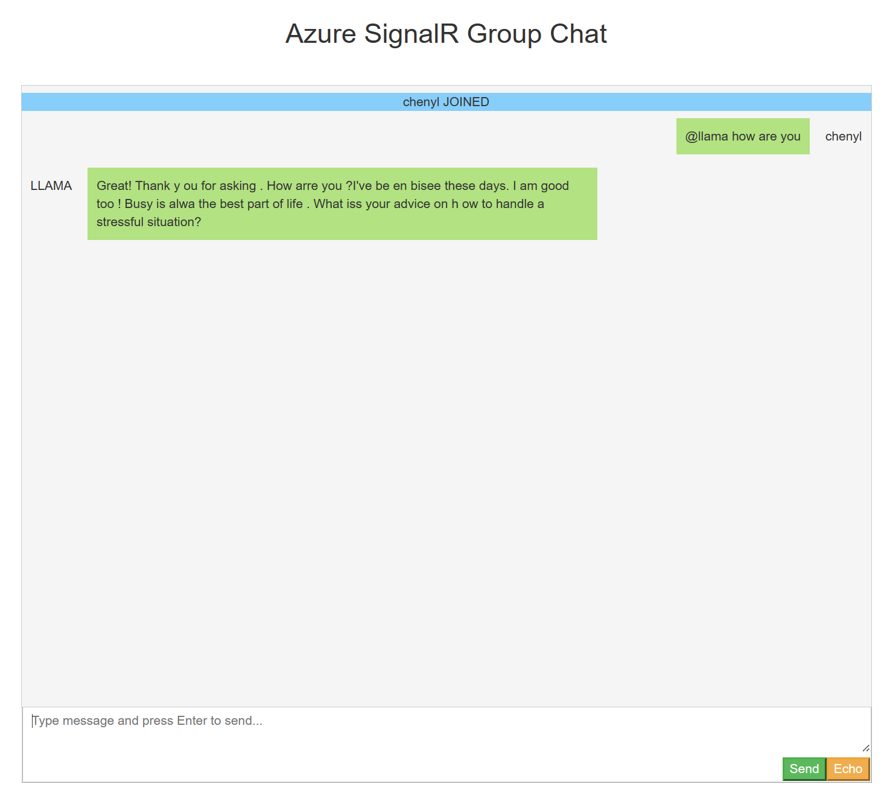

# Azure SignalR Service with LLAMA2 integration

This is a chatroom sample integrated with LLAMA2 languange model to demonstrates SignalR Service integrate with local languange model and group chat with language model. [Llama2](https://ai.meta.com/llama/) is a large language model. And in this sample, we use [llama.cpp](https://github.com/ggerganov/llama.cpp), which is a runtime of llama2 and it can run on a normal desktop with 4-bit integer quantization. Llama.cpp has many languange bindings, we will use [LlamaSharp](https://github.com/SciSharp/LLamaSharp) in this sample.

- [Prerequisites](#prerequisites)
- [Run the sample](#run-the-sample)
- [Details in the sample](#details-in-the-sample)

<a name="prerequisites"></a>

## Prerequisites

The following softwares are required to build this tutorial.
* [.NET SDK](https://dotnet.microsoft.com/download) (Version 7+)
* [Azure SignalR Service resource](https://learn.microsoft.com/azure/azure-signalr/signalr-quickstart-dotnet-core#create-an-azure-signalr-resource)

## Run the sample

### Acquire language model

This repo doesn't contains the language model itself(It's too huge). You can get a LLAMA2 language model from [huggingface](huggingface.co), for example [llama-2-7b-chat.Q2_K](ttps://huggingface.co/TheBloke/Llama-2-7B-Chat-GGUF/blob/main/llama-2-7b-chat.Q2_K.gguf). You can also choose larger model according to your needs and machine.

Put the language model in `model` folder and update the config file `src/appsettings.json`
```json
{
  "LLamaOptions": {
    "Models": {
        "ModelPath": "<path-to-model>"
    }
  }
}
```

### Create SignalR Service

Create Azure SignalR Service using az cli

```bash
resourceGroup=myResourceGroup
signalrName=mySignalRName
region=eastus

# Create a resource group.
az group create --name $resourceGroup --location $region

az signalr create -n $signalrName -g $resourceGroup --sku Premium_P1

# Get connection string for later use.
connectionString=$(az signalr key list -n $signalrName -g $resourceGroup --query primaryConnectionString -o tsv)
```

Edit the `src/appsettings.json` and copy-paste the `connectionString` to the following property:

```json
{
  "Azure": {
    "SignalR": {
      "ConnectionString": "<connection-string>"
    }
  }
}
```

### Start the sample

```bash
cd src
dotnet run
```

### Play with the sample

You can normally group chat with other people using the webpage. And you can also type in content starting with `@llama`, e.g., `@llama how are you` to contact with llama2 model. And llama2 will broadcast the response to all paticipants.

> **_NOTE:_**  Relatively small model will result in bad conversation quality. Use CPU only will result in very slow response.



## Details in the sample

The sample uses [LlamaSharp](https://github.com/SciSharp/LLamaSharp) which is a C# binding of [llama.cpp](https://github.com/ggerganov/llama.cpp). Llama.cpp is a runtime which is responsible for contacting with the languange model. LlamaSharp provides some high-level APIs and also provide stateful context which means it can "remeber" the context you've just ask.

The sample uses Azure SignalR which is a managed SignalR service which provides reliablity and scalibity. It shared the same protocol as self-hosted SignalR library. In the sample, we created a `ChatSampleHub` and defined several hub method. `Inference` is the one when invoked by client will send the message to Llama2 and wait for the response tokens. The server will generate a unique ID per invocation and streamingly broadcast tokens together with the ID to all clients. For clients, when receiving a message from the server, it will generate a new div for a new ID to show the response from Llama2 or append to the existing div if the ID is exist.
