# Build SignalR-based Android Chatting App

This tutorial shows you how to build and modify a BSignalR-based Android Chatting App. You'll learn how to:

> **&#x2713;** Build a mobile chat room client with SignalR client and Android Studio.
>
> **&#x2713;** Integrate the chat room app with [ReliableChatRoom Server](https://github.com/UncooleBen/AzureSignalR-samples/tree/master/samples/ReliableChatRoom)
>
> **&#x2713;** Chat with the mobile app.

## Prerequisites
* Install [.NET Core 3.0 SDK](https://dotnet.microsoft.com/download/dotnet-core/3.0) (Version >= 3.0.100)
* Install [Visual Studio 2019](https://visualstudio.microsoft.com/vs/) (Version >= 16.3)
* Install [Android Studio](https://developer.android.com/studio) (We use ver. 4.1)


## Build A Mobile Chat Room Client App With SignalR Library and Android Studio

0. Download or clone the Android Studio project
   
   ```cmd
   git clone https://github.com/uncooleben/AzureSignalR-samples.git
   ```

1. Open the directory as project in Android Studio

    Open Android Studio -> Open an Existing Project

    

    Select the project directory -> OK

    

2. Build the Android application

    Hit the hammer button

    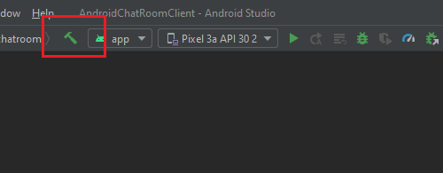

3. Download and place `google-services.json`

    1. In [Firebase Console](https://console.firebase.google.com/) -> Click your project

    2. In `Settings` -> `Project Settings` -> Download `google-services.json` -> Copy it to `AzureSignalR-samples\samples\MobileChatRoom\AndroidChatRoomClient\app\google-services.json`

## Chat With Mobile Chat Room App

1. Build and run your app server

    See [reference](https://github.com/UncooleBen/AzureSignalR-samples/blob/master/samples/ReliableChatRoom/README.md) of *Build A SignalR-based Reliable Mobile Chat Room Server*.
    
    In your chat room server project directory
    ```cmd 
    cd AzureSignalR-samples\samples\ReliableChatRoom\ReliableChatRoom
    dotnet run
    ```

2. Launch Android Chat Room Clients

    1. Create two AVD in the Android Emulator

        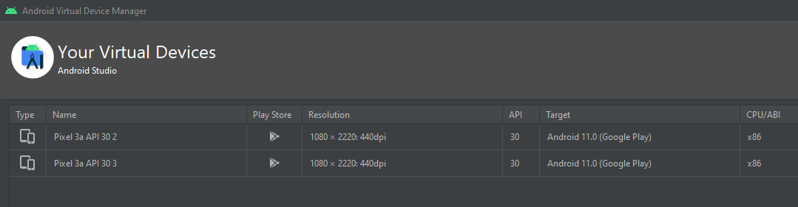

    2. Run the app on multiple clients

    3. Login with **different** usernames

        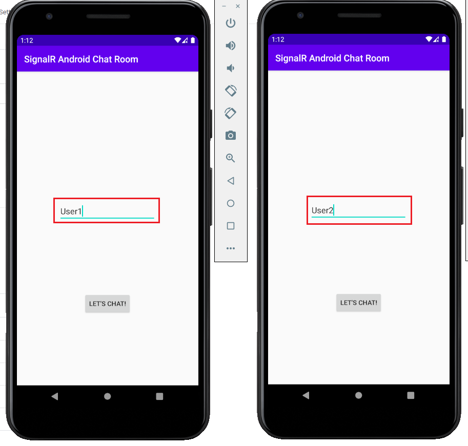

    4. Hit `LET'S CHAT!` button

    5. Start chatting
        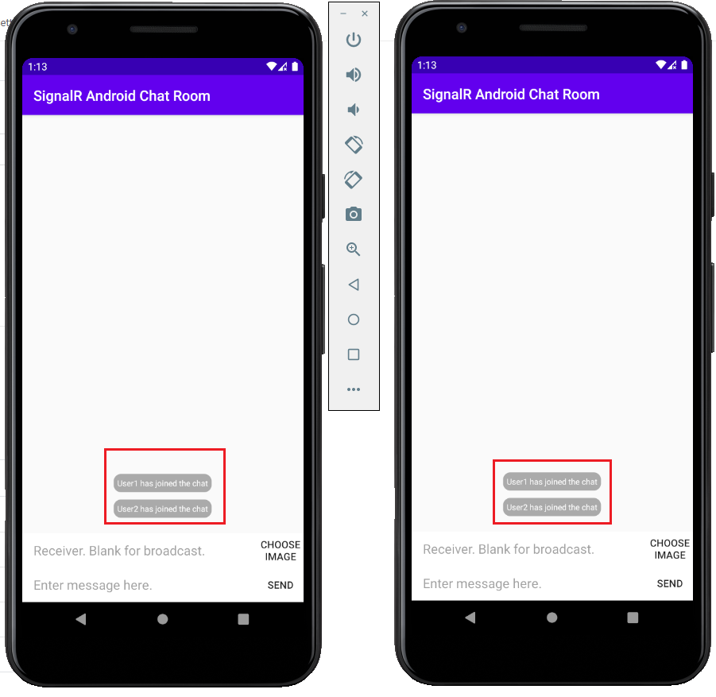

## How to Send Different Messages

1. Broadcast text message

    1. Leave the receiver field blank
    
    2. Type your message in message field

    3. Hit the `SEND` button

    

2. Private text message

    1. Type your receiver name in receiver field

    2. Type your message in message field

    3. Hit the `SEND` button

    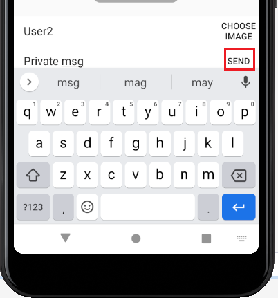

3. Broadcast image message

    1. Hit the `CHOOSE IMAGE` button and select your image

    2. The image you chose will be sent

    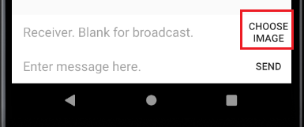

4. Private image message

    1. Type your receiver name in receiver field

    2. Hit the `CHOOSE IMAGE` button and select your image

    3. The image you chose will be sent

    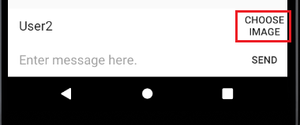

## Message Receiver Side

1. Offline Message Pulling

    If you login with an existing username, all related messages will be pulled from server at the start of your client session, i.e. after you hit the `LET'S CHAT!` button.

    Here's an example.

    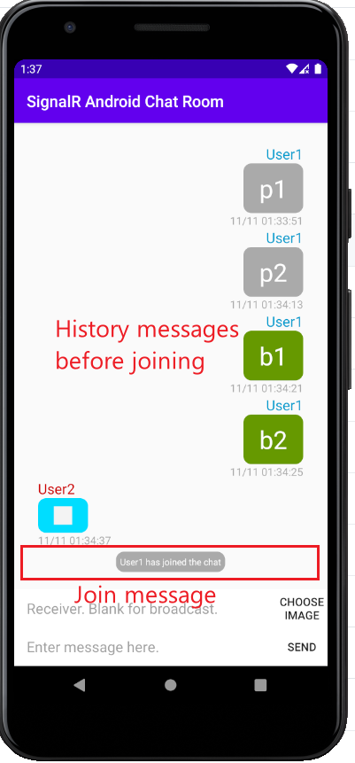

2. Image Message Loading

    If you are a receiver of any image message, you will see the message first as a white square inside the bubble. For example:

    

    To load the content of the image, just click the white square. There will be a smaller red square inside it indicating the loading of image. For example: 

    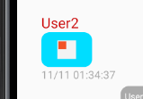

    After loading is finished, the whole content of image will show.

    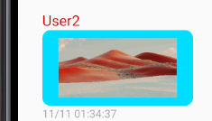

## Message Sender Side

1. Resend a message

    If your network status is unstable, your sent message might not be received by the server or your receiver client. To resend, just wait for the `Sending` status shown beside the bubble to turn to `Resend`, and the click the `Resend`.

    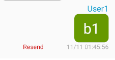

2. Status of private messages

    If you have sent a private message, you'll be able to see the status of your message. Currently, the message status includes: `Sending`, `Sent`, and `Read`.

    `Sending` - Your message is making its way to the chat room app server.

    `Sent` - Your message has arrived at the chat room app server, but hasn't been read by or sent to your receiver client,

    `Read` - Your message has been read by your receiver client.

    For example:

    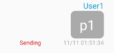
    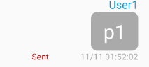
    