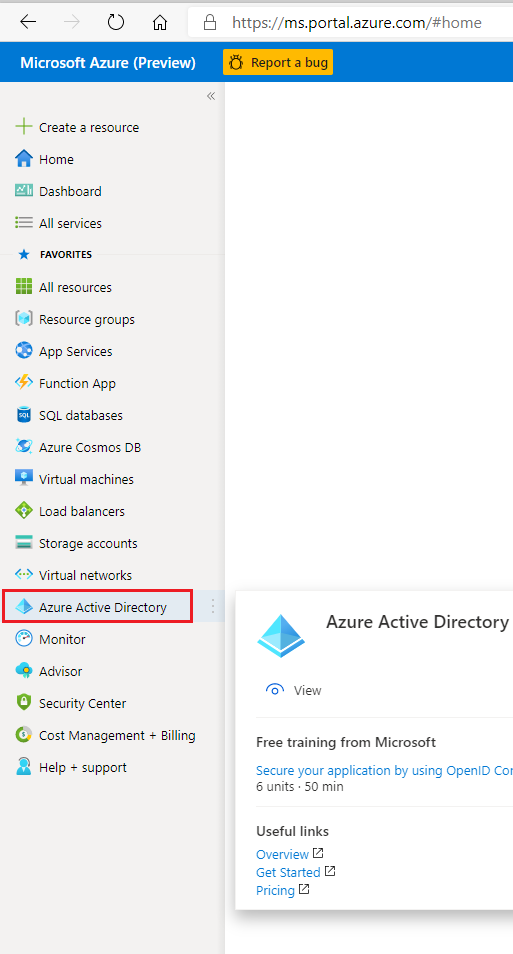
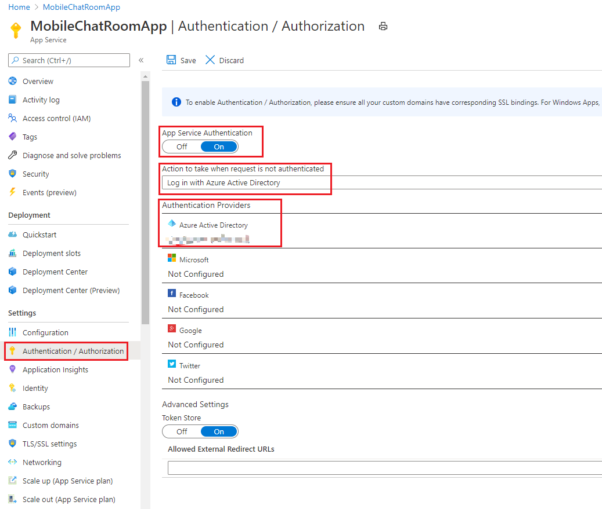

# Build SignalR-based Android Chatting App

This tutorial shows you how to build and modify a SignalR-based Android Chatting App. You'll learn how to:

> **&#x2713;** Create and Configure Your App in Azure Active Directory.
>
> **&#x2713;** Configure Your Local Android Mobile ChatRoom App.
>
> **&#x2713;** Integrate the chat room app with [ReliableChatRoom Server](../ReliableChatRoom/.)
>
> **&#x2713;** Chat With Mobile Chat Room App.
>

## Prerequisites
* Install [.NET Core 3.0 SDK](https://dotnet.microsoft.com/download/dotnet-core/3.0) (Version >= 3.0.100)
* Install [Visual Studio 2019](https://visualstudio.microsoft.com/vs/) (Version >= 16.3)
* Install [Android Studio](https://developer.android.com/studio) (We use ver. 4.1)


## Download Source Code from Repository

1. Download or clone the Android Studio project
   
   ```cmd
   git clone https://github.com/$USERNAME/AzureSignalR-samples.git
   ```

2. Open the directory as project in Android Studio

    Open Android Studio -> Open an Existing Project

    

    Select the project directory -> OK

    

3. Let the gradle run for dependency resolving while we move on to the next section.

## Configure Your App in Azure Active Directory

1. Enter `Azure Active Directory` in `Azure Portal`

    Enter [Azure Portal](https://portal.azure.com/) and click on `Azure Active Directory`

    

2. Register a new app

    1. Click on `App registrations` and then `New registration`

        

    2. Enter app name and chose the 3rd option in `Supported account types` 

        

    3. Click `Register` button at the bottom

3. Copy Client ID in the text editor for later use

    You can find Client ID in the `Overview` tab of your newly registered app.

    

4. Add an authentication for Android clients

    1. In the `Authentication` tab of your newly registered app, click `Add a platform`.

        

    2. Enter your Android app's package name (in our case should be `com.signalr.androidchatroom`) and a self-generated signature hash string with the provided command.

        

    3. Copy your generated signature hash string in text editor

    4. Click `Configure` button

    5. Click `Save` button at top-left

5. Wire your AAD Android authentication information into local Android App

    1. Click `View` button in your newly added Android authentication method.

        

    2. Copy the JSON by clicking the button and then paste it into `AzureSignalR-samples\samples\MobileChatRoom\AndroidChatRoomClient\app\src\main\res\raw\auth_config_single_account.json`

        

        There should already be a json file there. You can either replace the fields with ones you copied in your text editor earlier or just overwrite the whole file.

        


## Configure Your Local Android Mobile ChatRoom App and Azure App Service

1. Download and place `google-services.json`

    1. In [Firebase Console](https://console.firebase.google.com/) -> Click your project

    2. In `Settings` -> `Project Settings` -> Download `google-services.json` -> Copy it to `AzureSignalR-samples\samples\MobileChatRoom\AndroidChatRoomClient\app\google-services.json`

2. Paste your Azure Notification Hub connection string

    1. We assume you've already created an `Azure Notification Hub` when configuring the app server. If not, please read [*Build A SignalR-based Reliable Mobile Chat Room Server*](../ReliableChatRoom/README.md)

    2. Copy and paste the `Connection String` and `Hub Name` in `AzureSignalR-samples\samples\MobileChatRoom\AndroidChatRoomClient\app\src\main\res\values\strings_secrets.xml`

        
        

        
        

3. Paste your Azure App Service Url

    1. We assume you've already created an `Azure App Service` when configuring the app server. If not, please read [*Build A SignalR-based Reliable Mobile Chat Room Server*](../ReliableChatRoom/README.md)

    2. Copy and paste the `URL` to `AzureSignalR-samples\samples\MobileChatRoom\AndroidChatRoomClient\app\src\main\java\com\signalr\androidchatroom\service\SignalRService.java`

        
        

4. Allow client requests in `Azure App Service`

    1. We assume you've already created an `Azure App Service` when configuring the app server. If not, please read [*Build A SignalR-based Reliable Mobile Chat Room Server*](../ReliableChatRoom/README.md)

    2. Generate a client secret in AAD
    
        `Azure Active Directory` -> `App registrations` -> `YOUR_APP_NAME` -> `Certificates & secrets` -> `New client secret`

        

        Enter a `Description` and specify a `valid date` and then create the secret.

        Copy the `Value` field in text editor (This is the only chance to access the complete client secret value since old client secret values will **NOT** display, like the below image.)

        

    3. Add client secret to `Azure App Service`

        In `YOUR_AZURE_APP_SERVICE` -> `Authentication / Authorization`, turn on `App Service Authentication` switch;
        
        Select `Action to take when request is not authenticated` to `Log in with Azure Active Directory`;
        
        Click `Azure Active Directory` in `Authentication Providers`.

        

        In the detailed configuration dialog, switch `Management mode` to `Advanced` and click `Show Secret`;
        
        Paste your AAD Client ID in the `Client ID` field;
        
        Paste your client secret value to `Client Secret (Optional)` field;
        
        For `Issuer Url` field, if you would like anyone with a Microsoft/Outlook/Live/Xbox account to sign into your app, use `https://login.microsoftonline.com/common/v2.0`.
        
        Otherwise, if only accounts under your AAD are allowed, use your own AAD endpoint URL which should align with the format of `https://login.microsoftonline.com/YOUR_AAD_TENANT_OR_DIRECTORY_ID/v2.0`.

        

        Don't forget to click `OK` and then `Save` the `Authentication / Authorization`.


## Chat With Mobile Chat Room App

1. Build and run your app server
    
    You have two options:
    
    1. Run app server locally

        In `AzureSignalR-samples\samples\MobileChatRoom\AndroidChatRoomClient\app\src\main\java\com\signalr\androidchatroom\service\SignalRService.java`

        Set `serverUrl` field to `localDebugUrl`.
    
        In your chat room server project directory
        ```cmd 
        cd AzureSignalR-samples\samples\ReliableChatRoom\ReliableChatRoom
        dotnet run
        ```

    2. Publish and run app server on `Azure App Service`

        In `AzureSignalR-samples\samples\MobileChatRoom\AndroidChatRoomClient\app\src\main\java\com\signalr\androidchatroom\service\SignalRService.java`

        Set `serverUrl` field to `azureAppServiceUrl`.
        
        See [reference](../ReliableChatRoom/README.md) of *Build A SignalR-based Reliable Mobile Chat Room Server*.


2. Launch Android Chat Room Clients

    1. Create two AVD in the Android Emulator

        

    2. Run the app on multiple devices

        

    3. Hit `LET'S CHAT!` button

        

    4. Log in with Microsoft/Outlook/Live/Xbox account

        

    5. Start chatting
        

## How to Send Different Messages

1. Broadcast text message

    1. Leave the receiver field blank
    
    2. Type your message in message field

    3. Hit the `SEND` button

    

2. Private text message

    1. Type your receiver name in receiver field

    2. Type your message in message field

    3. Hit the `SEND` button

    

3. Broadcast image message

    1. Hit the `CHOOSE IMAGE` button and select your image

    2. The image you chose will be sent

    

4. Private image message

    1. Type your receiver name in receiver field

    2. Hit the `CHOOSE IMAGE` button and select your image

    3. The image you chose will be sent

    

## Message Receiver Side

1. History Message Pulling

    Manually swipe down at the very top of message list and then release will trigger a history message pulling request.

    Here's an example.

    

2. Image Message Loading

    If you are a receiver of any image message, you will see the message first as a white square inside the bubble. For example:

    

    To load the content of the image, just click the white square. There will be a smaller red square inside it indicating the loading of image. For example: 

    

    After loading is finished, the whole content of image will show.

    

## Message Sender Side

1. Resend a message

    If your network status is unstable, your sent message might not be received by the server or your receiver client. To resend, just wait for the `Sending` status shown beside the bubble to turn to `Resend`, and the click the `Resend`.

    

2. Status of private messages

    If you have sent a private message, you'll be able to see the status of your message. Currently, the message status includes: `Sending`, `Sent`, and `Read`.

    `Sending` - Your message is making its way to the chat room app server.

    `Sent` - Your message has arrived at the chat room app server, but hasn't been read by or sent to your receiver client,

    `Read` - Your message has been read by your receiver client.

    For example:

    
    
    

## Client-side Interface Specification

Overview:


Java view:

```java
/**
 * Receives a system message from SignalR server.
 *
 * @param messageId A server-generated unique string of message id.
 * @param payload Body content of the system message (can only be text).
 * @param sendTime A long int representing the time when the system was sent.
 */
void receiveSystemMessage(String messageId, String payload, long sendTime);

/**
 * Received a broadcast message from SignalR server.
 *
 * @param messageId A server-generated unique string of message id.
 * @param sender A string of sender.
 * @param receiver A string of receiver (can only be "BCAST").
 * @param payload Body content of the broadcast message (can be either text
 *                or binary image contents encoded in base64).
 * @param isImage A boolean indicating whether the broadcast is an image message.
 * @param sendTime A long int representing the time when the system was sent.
 * @param ackId A string of ack id that client will later send back to server as Ack response.
 */
void receiveBroadcastMessage(String messageId, String sender, String receiver, String payload, boolean isImage, long sendTime, String ackId);

/**
 * Received a private message from SignalR server.
 *
 * @param messageId A server-generated unique string of message id.
 * @param sender A string of sender.
 * @param receiver A string of receiver.
 * @param payload Body content of the broadcast message (can be either text
 *                or binary image contents encoded in base64).
 * @param isImage A boolean indicating whether the broadcast is an image message.
 * @param sendTime A long int representing the time when the system was sent.
 * @param ackId A string of ack id that client will later send back to server as Ack response.
 */
void receivePrivateMessage(String messageId, String sender, String receiver, String payload, boolean isImage, long sendTime, String ackId);

/**
 * Receives history messages from SignalR server.
 * Usually called by server right after a client pullHistoryMessage request.
 *
 * @param serializedString A json string of list of history messages.
 */
void receiveHistoryMessages(String serializedString);

/**
 * Receives image content from SignalR server.
 *
 * @param messageId A string representing a message id.
 * @param payload Binary image contents encoded in base64.
 */
void receiveImageContent(String messageId, String payload);

/**
 * Receives a client read response from SignalR server.
 * The client read response is sent from another client to server.
 *
 * @param messageId A string representing a message id.
 * @param username A string representing the username of sender of the read response.
 */
void clientRead(String messageId, String username);

/**
 * Receives a server ack from SignalR server.
 * The server ack is a server response of successfully receiving a client message.
 *
 * @param messageId A string representing a message id.
 * @param receivedTimeInLong A long int representing the received time in milliseconds.
 */
void serverAck(String messageId, long receivedTimeInLong);

/**
 * Expires a client session from SignalR server.
 *
 * @param isForced A boolean indicating whether the expire is forced.
 */
void expireSession(boolean isForced);
```