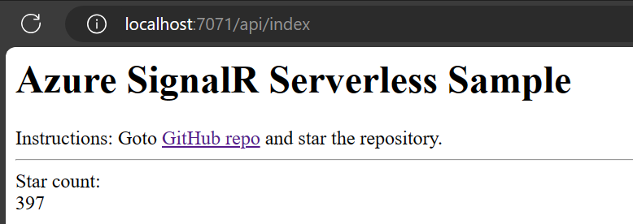

# SignalR Service Serverless Quick Start (JavaScript)

In this sample, we demonstrate how to broadcast messages with SignalR Service and Azure Function in serverless.

## Prerequisites

* [Azure Function Core Tools](https://www.npmjs.com/package/azure-functions-core-tools)
* [Node.js LTS](https://nodejs.org/en/download/)

## Azure Functions with CommonJS 

Because ESM support is still in [preview for Azure Functions](https://learn.microsoft.com/azure/azure-functions/functions-reference-node?tabs=javascript%2Cwindows%2Cazure-cli&pivots=nodejs-model-v4#ecmascript-modules), this quickstart uses CommonJS modules including node-fetch. If you update the node-fetch package to 3.x, you may need to update the code to use ESM modules, which requires changing from `const` to `import` and `*.js` to `*.mjs`.

## Setup and run locally

1. Start local storage emulator in terminal.

    ```bash
    npm run start:azurite
    ```

1. Rename `local.settings.template.json` to `local.settings.json` and update env variable.

    * `SIGNALR_CONNECTION_STRING`: The connection string of your Azure SignalR Service.

1. Run command to start Azure Function locally in different terminal.

    ```bash
    npm start
    ```

1. Visit `http://localhost:7071/api/index`.

    

1. Go to this repo's home page and click the star button to increase or decrease the star count.

1. The Azure Functions **broadcast** function is triggered every minute to see if the star count has changed. If it has chanaged base on checking the eTag, a new star count is sent as a message to the client. 