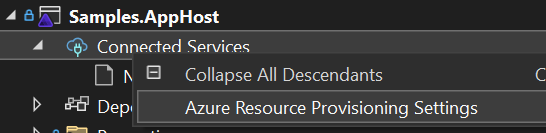
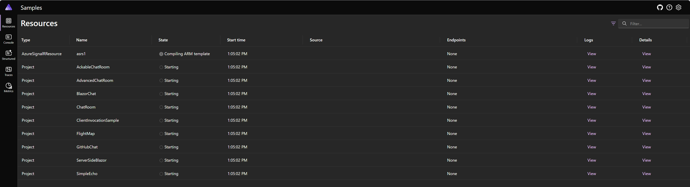

# Run the samples

[.NET Aspire](https://learn.microsoft.com/dotnet/aspire/get-started/aspire-overview#orchestration) is used to orchestrate the samples.

## Run with aspire ready in visual studio

To work with .NET Aspire, you need the following installed locally:
- [.NET 8.0](https://dotnet.microsoft.com/download/dotnet/8.0)
- .NET Aspire workload:
  - Installed with the [Visual Studio installer](../fundamentals/setup-tooling.md?tabs=visual-studio#install-net-aspire) or [the .NET CLI workload](../fundamentals/setup-tooling.md?tabs=dotnet-cli#install-net-aspire).
- An OCI compliant container runtime, such as:
  - [Docker Desktop](https://www.docker.com/products/docker-desktop) or [Podman](https://podman.io/).
 
Open [samples.sln](./samples.sln) in Visual Studio, set **Samples.AppHost** project as the Startup Project. Right click **Connected Services** and select **Azure Resource Provisioning Settings** and select your Azure subscription, region and resource group to use.



Alternatively, you could add Azure related configurations in the appsettings.json file:
  ```json
  {
    "Azure": {
      "SubscriptionId": "your subscription",
      "Location": "your location"
    }
  }
  ```

Run the project and use Aspire dashboard to navigate to different samples:



## Run without aspire

Aspire helps you to automatically provision a new Azure SignalR resource and set the connection strings for the sample to use automatically. You could still use the traditional way to set the connection strings by yourself and run the sample directly. Samples now use named connection string `AddNamedAzureSignalR("signalr1")`. Set your connection string to `signalr1:Azure:SignalR:ConnectionString`, or `ConnectionStrings:signalr1`:

```
dotnet user-secrets set Azure:SignalR:signalr1:ConnectionString "<Your connection string>"
```

```
dotnet user-secrets set ConnectionStrings:signalr1 "<Your connection string>"
```