# Build SignalR-based Realtime Code Editor Interview App

This tutorial shows you how to build and modify a SignalR-based Realtime Code Editor Interview App. You'll learn how to:

> **&#x2713;** Create and Configure Sign-In in Azure Active Directory.
>
> **&#x2713;** Create and Assign User Roles in Azure Active Directory.
>
> **&#x2713;** Configure and Build Your SignalR-based Realtime Code Editor Interview App.
>
> **&#x2713;** Play with Your Realtime Code Editor as Multiple Roles.
>

## Prerequisites
* Install [.NET Core 3.0 SDK](https://dotnet.microsoft.com/download/dotnet-core/3.0) (Version >= 3.0.100)
* Install [Visual Studio 2019](https://visualstudio.microsoft.com/vs/) (Version >= 16.3)

## Create and Configure Sign-In in Azure Active Directory

1. [Azure Portal](https://portal.azure.com/) -> Azure Active Directory -> App Registrations -> New Registration

    Type preferred **name** and select **Supported account Types**

    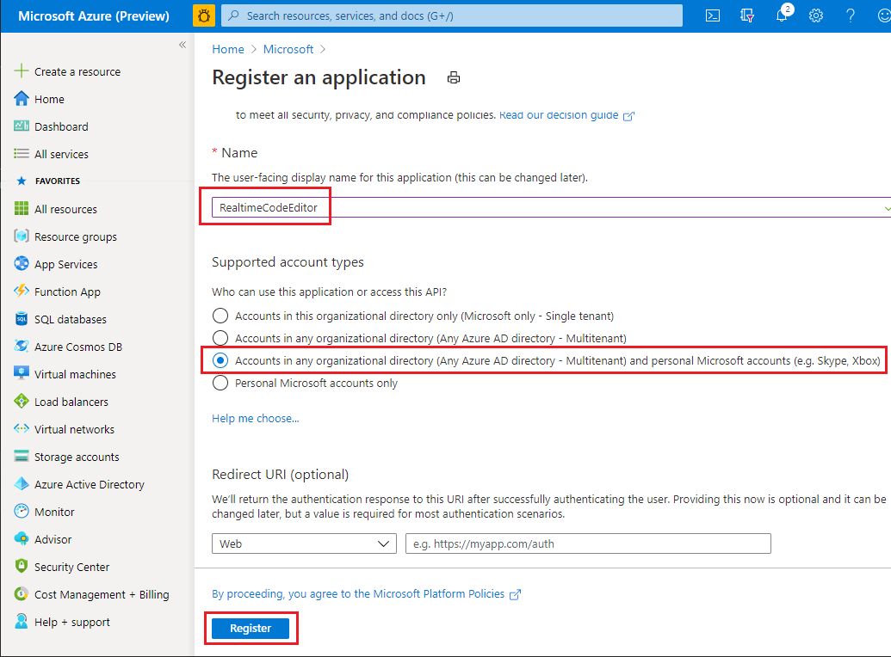

    Click **Register**

2. Select your created app in [Azure Portal](https://portal.azure.com/) -> Azure Active Directory -> App Registrations -> RealtimeCodeEditor

    Authentication -> Add a platform -> Web

    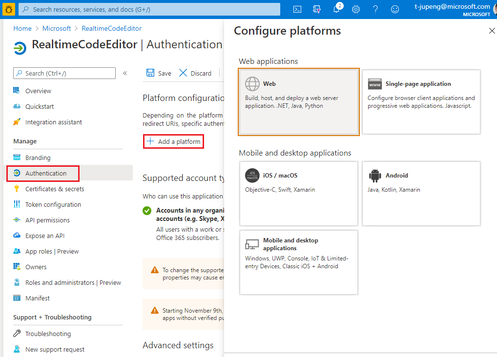

    Use `https://localhost:5001/signin-oidc` as **Redirect URLs**

    User `https://localhost:5001/signout-oidc` as **Front-channel logout URL**

    Check both tokens

    Click **Configure**

    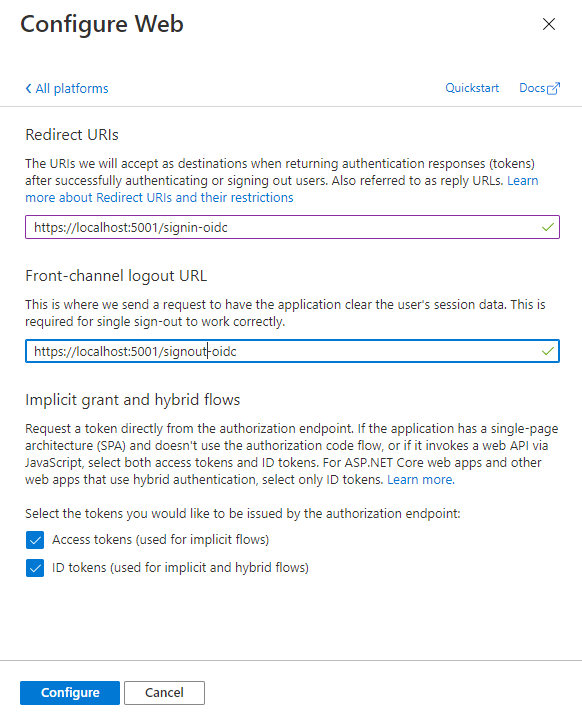

    Don't forget to **Save** 

    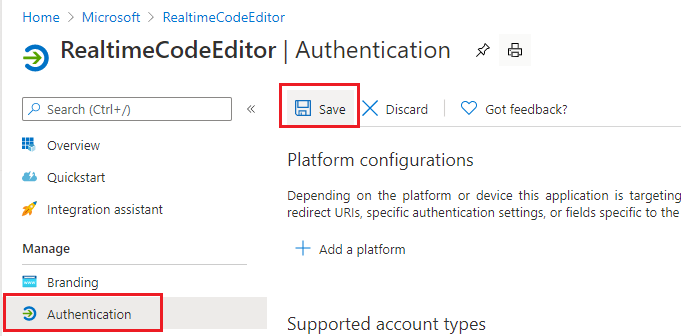

3. Select your created app in [Azure Portal](https://portal.azure.com/) -> Azure Active Directory -> App Registrations -> RealtimeCodeEditor -> Overview
    
    Copy your **Directory (tenant) ID** and **Application (client) ID** in texteditor as you will need them when configuring the web app

    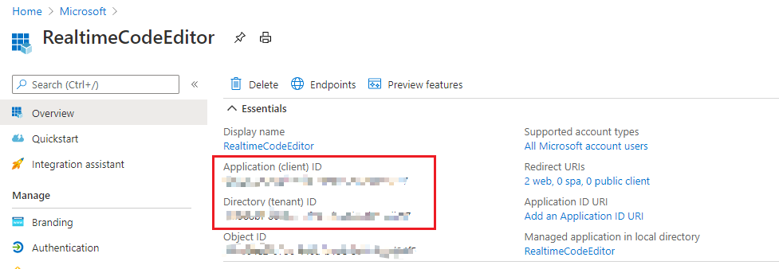

## Create and Assign User Roles in Azure Active Directory

1. Select your created app in [Azure Portal](https://portal.azure.com/) -> Azure Active Directory -> App Registrations -> RealtimeCodeEditor -> App roles

    Click **Create app role**
    
    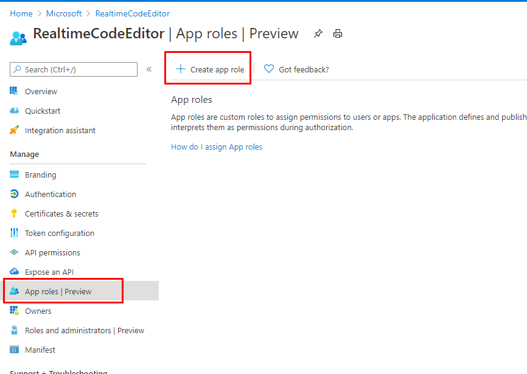

    Create two roles described as follow:

    | Display name | Allowed member types | Value | Description |
    |--------------|----------------------|-------|-------------|
    |Interviewer   | Users/Groups         | Interviewer| Interviewers have the ability to lock the codeeditor from interviewees.|
    |Interviewee | Users/Groups | Interviewee | Interviewees have the ability to edit text when not locked.|

    The page will be like:

    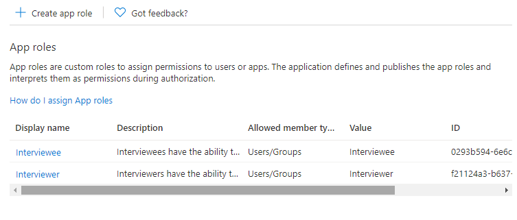

2. Add **Interviewer** accounts

    [Azure Portal](https://portal.azure.com/) -> Azure Active Directory -> s -> Enterprise applications -> Search `RealtimeCodeEditor` -> Click `RealtimeCodeEditor`

    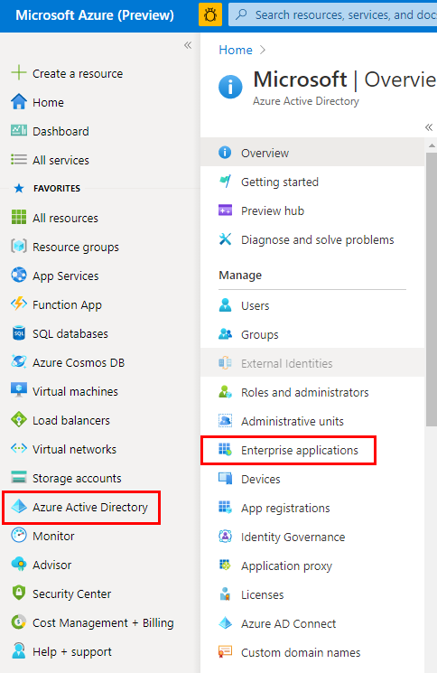

    Select **Users and groups** in the left panel and click the **Add user/group** button

    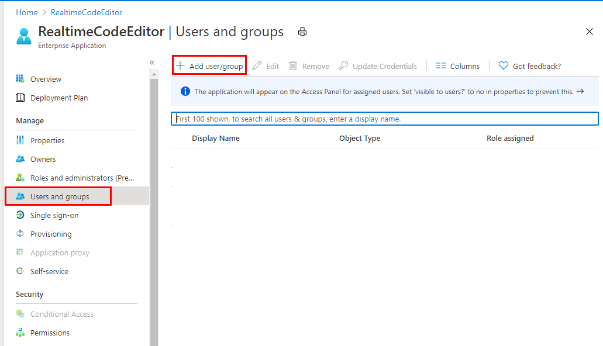

    Select your desired interviewer account and assign **Interviewer** role to it.

    Select your desired interviewee account and assign **Interviewee** role to it.

## Configure and Build Your SignalR-based Realtime Code Editor Interview App

1. Clone the project and open it with Visual Studio 2019

    ````
    git clone https://github.com/YOUR_ACCOUNT/AzureSignalR-samples
    ````

    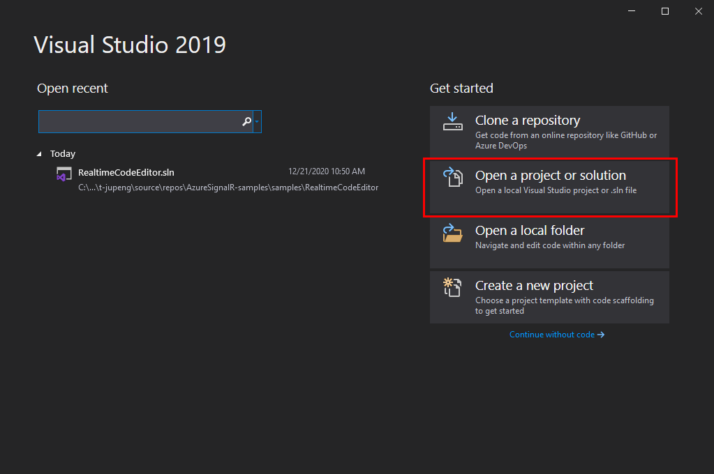

2. Congifure AAD Sign-In

    Open `appsettings.json` -> Paste/Replace your ClientId -> Paste/Replace your TenantId **Only if you want to block signing in with accounts outside of your organization**, otherwise, leave the TenantId as `common`

    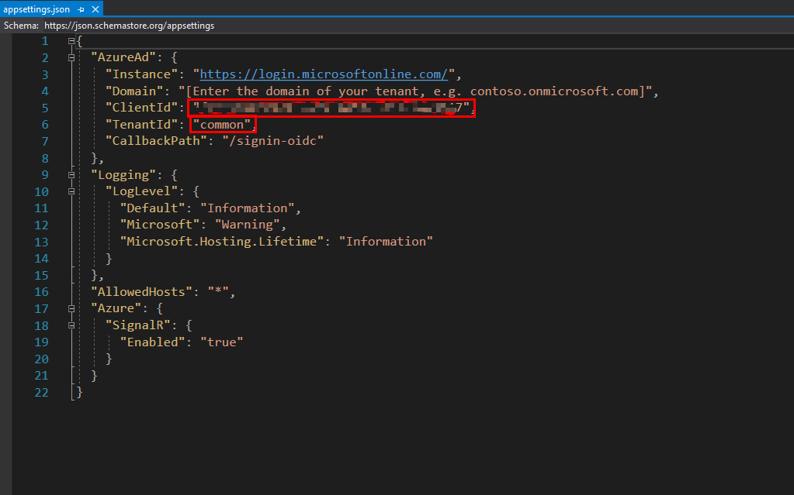


