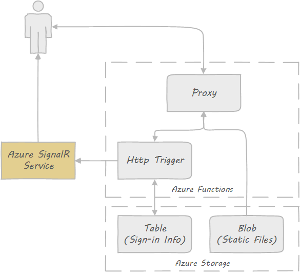

# Realtime Sign-in Example using Azure SignalR Service

[Not working after latest SignalR update, still working on a fix]

This sample application shows how to build a realtime application using Azure SignalR Service and serverless architecture. When you open homepage of the application, you will see how many people has visited this page (and their OS and browser distribution) and the page will auto update when others open the same page.

A live demo can be found [here](https://signalrsignin.azurewebsites.net).

## How Does It Work

The application is built on top of Azure SignalR Service, Functions and Storage. There is no web server needed in this sample.

Here is a diagram that illustrates the structure of this appliaction:



1. When user opens the homepage, a HTTP call will be made to an API exposed by Azure Function HTTP trigger, which will record your information and save it to Azure table storage.
2. This API also returns a url and token for browser to connect to Azure SignalR Service.
3. Then the API calculate statistics information (number of visits, OS and browser distribution) and use Azure SignalR Service to broadcast to all clients so browser can do a realtime update without need to do a refresh.
4. The static content (homepage, scripts) are stored in Azure blob storage and exposed to user through Azure Function proxy.

## Deploy to Azure

### Deploy Static Files

1. Create storage account

   ```
   az storage account create \
      --location <location> \
      --name <account_name> \
      --resource-group <resource_group> \
      --sku Standard_LRS
   ```

2. Create container and table

   ```
   az storage table create --name SignInInfo
   az storage container create --account-name <account_name> --name content --public-access blob
   ```

3. Upload static files

   ```
   az storage blob upload -c content --account-name <account_name> -n index.html -f index.html
   az storage blob upload -c content --account-name <account_name> -n scripts/signalr.min.js -f scripts/signalr.min.js
   az storage blob upload -c content --account-name <account_name> -n scripts/qrcode.min.js -f scripts/qrcode.min.js
   ```


### Deploy Azure Function

1. Create Azure function

   ```
   az group create --name <resource_group_name> --location CentralUS
   az storage account create --resource-group <resource_group_name> --name <storage_account_name> \
      --location CentralUS --sku Standard_LRS
   az functionapp create --resource-group <resource_group_name> --name <function_name> \
      --consumption-plan-location CentralUS --storage-account <storage_account_name>
   ```

2. Configure deployment credentials

   ```
   az functionapp deployment source config-local-git --resource-group <resource_group_name> --name <function_name>
   az functionapp deployment user set --user-name <user_name> --password <password>
   ```

3. Build and deploy Azure function

   ```
   nuget restore
   msbuild /p:Configuration=Release

   cd bin\Release\net461
   git init
   git remote add origin <deploy_git_url>
   git add -A
   git commit -m "init commit"
   git push origin master
   ```

4. Update application settings

   ```
   az functionapp config appsettings set --resource-group <resource_group_name> --name <app_name> \
      --setting TableConnectionString=<table_connection_string>
   az functionapp config appsettings set --resource-group <resource_group_name> --name <app_name> \
      --setting BlobUrl=<blob_url>
   az functionapp config appsettings set --resource-group <resource_group_name> --name <app_name> \
      --setting AzureSignalRConnectionString=<signalr_connection_string>
