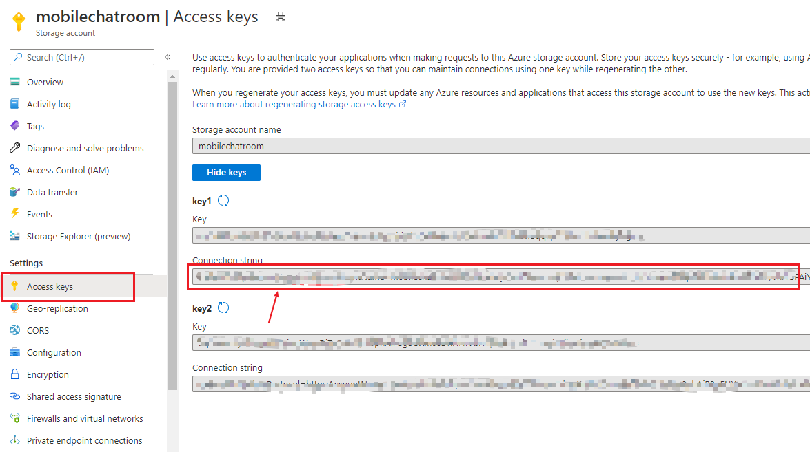
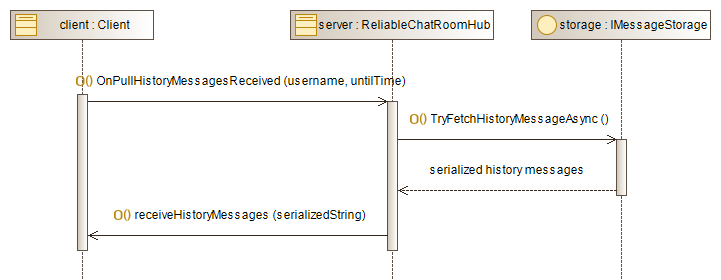

# Build A SignalR-based Reliable Mobile Chat Room Server

This tutorial shows you how to build a reliable mobile chat room server with SignalR. You'll learn how to:

> **&#x2713;** Build a simple reliable chat room with Azure SignalR.
>
> **&#x2713;** Integrate chat room server with Firebase Notification.
> 
> **&#x2713;** Use Azure Storage table and blob services.

## Prerequisites
* Install [.NET Core 3.1 SDK](https://dotnet.microsoft.com/download/dotnet-core/3.1)
* Install [Visual Studio 2019](https://visualstudio.microsoft.com/vs/) (Version >= 16.3)
* Create an [Azure SignalR Service](https://azure.microsoft.com/en-us/services/signalr-service/)
* Create an [Azure Storage Account](https://docs.microsoft.com/en-us/azure/storage/common/storage-account-overview)
* Create an [Azure Notification Hub](https://azure.microsoft.com/en-us/services/notification-hubs/)
* Create a [Google Firebase Service](https://firebase.google.com/)

## Abstract

There are four main conponents in a reliable chat room server-side system:
1. [**Google Firebase**](#create-and-setup-your-google-firebase-service-for-notificaiton) and [**Azure Notification Hub**](#create-and-setup-your-azure-notification-hub-service) that wraps it as notification service
2. [**Azure Storage**](#create-your-azure-storage-account) as message storage service
3. [**Azure SignalR Service**](#create-your-azure-signalr-service) as message delievery service
4. Local [**.NET chat room server**](#configure-your-reliable-chat-room-server)


This repo will focus on **.NET Chat Room Server** and its interaction with those components mentioned above.

## Create and Setup Your Google Firebase Service For Notificaiton

See Google [reference](https://firebase.google.com/docs/cloud-messaging/android/client) of *Set up a Firebase Cloud Messaging client app on Android*.

Get the server key we need to build the chat room server:

1. Goto [Firebase Console](https://console.firebase.google.com/) and select your client app


2. *Goto Settings -> Project Settings -> Cloud Messaging Tab* and then copy your server key

If there is no server key here, add one. 

You will need to use the server key in Azure Notification Hub Service.

## Create and Setup Your Azure Notification Hub Service

See [reference](https://docs.microsoft.com/en-us/azure/notification-hubs/notification-hubs-android-push-notification-google-fcm-get-started) of *Tutorial: Send push notifications to Android devices using Firebase SDK version 0.6*

One core thing to do is adding your Firebase Server Key into your Notification Hub:

1. Enter your Notification Hub in [Azure Portal](https://ms.portal.azure.com/) and click *Google (GCM/FCM)*


2. Paste your server key in the server input


## Create Your Azure Storage Account

See [reference](https://docs.microsoft.com/en-us/azure/storage/common/storage-account-create?tabs=azure-portal) of *Create a storage account*.

We will need connection string for chat room server:

1. Enter your Storage Account in [Azure Portal](https://ms.portal.azure.com/) and click *Access Keys*


2. Copy your Storage Account connection string



## Create Your Azure SignalR service

See [reference](https://docs.microsoft.com/en-us/azure/azure-signalr/signalr-quickstart-dotnet-core#:~:text=To%20create%20an%20Azure%20SignalR,the%20results%2C%20and%20select%20Create.) about *Quickstart: Create a chat room by using SignalR Service*.

We will need connection string for chat room server:

1. Enter your SignalR Service in [Azure Portal](https://ms.portal.azure.com/) and click *Keys*


2. Copy your SignalR Service connection string


## Configure Your Reliable Chat Room Server

See [reference](https://docs.microsoft.com/en-us/aspnet/core/security/app-secrets?view=aspnetcore-3.1&tabs=windows) about *Safe storage of app secrets in development in .NET Core*.

0. Clone/download the source code from repo. 

```dotnet cli
git clone https://github.com/$USERNAME/AzureSignalR-samples.git
```

1. Change your directory to the project directory

```dotnet cli
cd ./samples/ReliableChatRoom/ReliableChatRoom/
```

2. Initialize user-secrets

```dotnetcli
dotnet user-secrets init
```

3. Add user secrets

```dotnetcli
dotnet user-secrets set "Azure:SignalR:ConnectionString" $YOUR_SIGNALR_CONNECTION_STRING
dotnet user-secrets set "Azure:Storage:ConnectionString" $YOUR_STORAGE_ACCOUNT_CONNECTION_STRING
dotnet user-secrets set "Azure:NotificationHub:HubName" $YOUR_HUB_NAME
dotnet user-secrets set "Azure:NotificationHub:ConnectionString" $YOUR_NOTIFICATION_HUB_CONNECTION_STRING
```

## Run Your Reliable Chat Room Server

```dotnet cli
dotnet run
```

If succeed, the output will be like:
```dotnet cli
Hosting environment: Development
Content root path: *\source\repos\AzureSignalR-samples\samples\ReliableChatRoom\ReliableChatRoom
Now listening on: http://localhost:5000
Now listening on: https://localhost:5001
Application started. Press Ctrl+C to shut down.
```

## How Does Reliable Chat Protocol Work?

1. Client enters the chat room


2. Client broadcasts a message to all other clients


3. Client sends a private message to another client


4. Client pulls history messages from server



5. Client pull image content from server


6. Client leaves the chat room


## How Can I Integrate the Reliable Chat Room Server with Clients

We provide a sample Android mobile chat room app which works with the `Reliable Chat Room Server`. Please see [reference](../MobileChatRoom/.)

## Server-side Interface Specification

Overview:


C Sharp view, see [source code](./ReliableChatRoom/Hubs/ReliableChatRoomHub.cs) for details.

```C#
/// <summary>
/// Hub method. Called everytime when client trys to log into hub with a new (or expired) session.
/// </summary>
/// <param name="deviceUuid">A random id of client device, used for notification service</param>
/// <param name="username">The username of client</param>
/// <returns></returns>
public async Task EnterChatRoom(string deviceUuid, string username)

/// <summary>
/// Hub method. Called everytime when client trys to ping the server to extend his/her session and stay alive.
/// </summary>
/// <param name="deviceUuid">A random id of client device, used for notification service (may be a new id)</param>
/// <param name="username">The username of client</param>
/// <returns></returns>
public async Task TouchServer(string deviceUuid, string username)

/// <summary>
/// Hub method. Called when client explicitly quits the chat room.
/// </summary>
/// <param name="deviceUuid">A random id of client device, used for notification service (may be a new id)</param>
/// <param name="username">The username of client</param>
/// <returns></returns>
public async Task LeaveChatRoom(string deviceUuid, string username)

/// <summary>
/// Hub method. Called when client sends a broadcast message.
/// </summary>
/// <param name="messageId">The messageId generated by client side</param>
/// <param name="sender">The client who send the message</param>
/// <param name="payload">The message content. Can be string / binary object in base64</param>
/// <param name="isImage">Whether incoming message is an image message</param>
/// <returns></returns>
public async Task OnBroadcastMessageReceived(string messageId, string sender, string payload, bool isImage)

/// <summary>
/// Hub method. Called when client sends a private message.
/// </summary>
/// <param name="messageId">The messageId generated by client side</param>
/// <param name="sender">The client who sends the message</param>
/// <param name="receiver">The client who receives the message</param>
/// <param name="payload">The message content. Can be string / binary object in base64</param>
/// <param name="isImage">Whether incoming message is an image message</param>
/// <returns></returns>
public async Task OnPrivateMessageReceived(string messageId, string sender, string receiver, string payload, bool isImage)

/// <summary>
/// Hub method. Called when client sends back an ACK on any message.
/// </summary>
/// <param name="clientAckId">The unique id representing a ClientAck object</param>
/// <param name="username">The ack sender's username</param>
public void OnAckResponseReceived(string clientAckId, string username)

/// <summary>
/// Hub method. Called when client broadcasts his/her read status on a specific message.
/// Be advised. Only <see cref="MessageTypeEnum.Private"/> messages have status of read.
/// </summary>
/// <param name="messageId">The messageId generated by client side</param>
/// <param name="username">The username of the client</param>
/// <returns></returns>
public async Task OnReadResponseReceived(string messageId, string username)

/// <summary>
/// Hub method. Called when client requests to pull his/her history message.
/// </summary>
/// <param name="username">The username of the client</param>
/// <param name="untilTime">The earliest message stored on the client. Any message
/// after the untilTime will not be pulled</param>
/// <returns></returns>
public async Task OnPullHistoryMessagesReceived(string username, long untilTime)

/// <summary>
/// Hub method. Called when client wants to fetch the content of an image message.
/// </summary>
/// <param name="username"></param>
/// <param name="messageId"></param>
/// <returns></returns>
public async Task OnPullImageContentReceived(string username, string messageId)
```