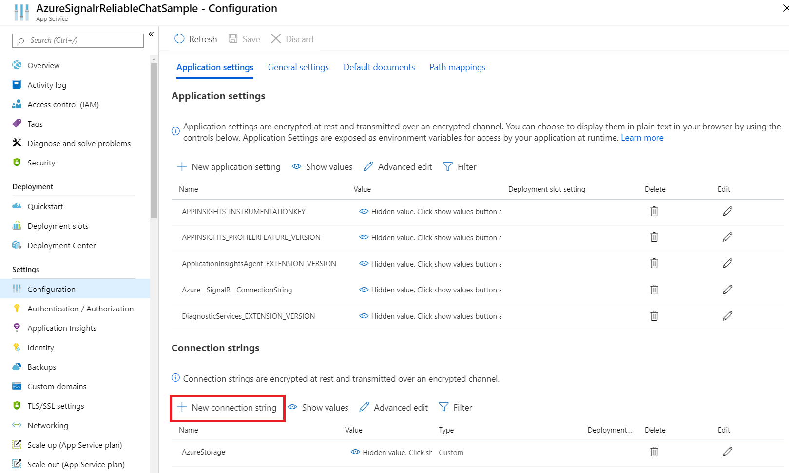

# Azure SignalR Service Advanced Chat Room

Just like [ChatRoom sample](../ChatRoom), you have learned how to use Azure SignalR Service to build a chat room application. This sample demostrates a chat room with more general features in a chat application.
In this tutorial, you'll learn how to use Azure Storage Service and Azure Web App Service to get everything running in the cloud.

Now the sample supports:

* Broadcast
* Joined / Left Broadcast
* New message notification 
* Send to User in a private chat room
* Replay history messages

## Provision storage service for data

We support the dependency injection (DI) software design pattern for the storage of messages and sessions.

### Store the data in memory

Sometimes we don't need to store data in a real database (For example, in a test environment.)
You should register the service in the app's `Startup.ConfigureServices` method.

```cs
public void ConfigureServices(IServiceCollection services)
{
	...
	services.AddSingleton<ISessionHandler, InMemorySessionStorage>();
	services.AddSingleton<IMessageHandler, InMemoryMessageStorage>();
}
```

### Store the data in Azure Table

> If you don't have an Azure Storage Account, **[start now](https://azure.microsoft.com/en-us/services/storage/tables/)** to create one for your project.

In `Startup.ConfigureServices` method, instead of registering `InMemorySessionStorage` and `InMemoryMessageStorage`, you need to use `AzureTableSessionStorage` and `AzureTableMessageStorage` and pass in connection string to make the application connect to the service.

```cs
public void ConfigureServices(IServiceCollection services)
{
	...
	services.AddSingleton<ISessionHandler, AzureTableSessionStorage>();
	services.AddSingleton<IMessageHandler, AzureTableMessageStorage>();
}
```

Now set the connection string in the [Secret Manager](https://docs.microsoft.com/en-us/aspnet/core/security/app-secrets?view=aspnetcore-2.1&tabs=visual-studio#secret-manager) tool for .NET Core, and run this app.

```
dotnet restore
dotnet user-secrets set ConnectionStrings:AzureStorage "<Your connection string>"
dotnet run
```

## Quick Deploy via Docker image
You can also deploy this sample via existing docker image

```
docker run -e Azure__SignalR__ConnectionString="<signalr-connection-string>" \
           -e STORAGE_CONN_STRING="<storage-connection-string>" \
		   -p 5000:80 mcr.microsoft.com/signalrsamples/reliablechatroom:latest
```


### Use your own database

If you want to use your own database to store the messages and sessions, you should create a class which implements [ISessionHandler](./SessionHandler/ISessionHandler.cs) and another one implementing [IMessageHandler](./MessageHandler/IMessageHandler.cs).

Then, register your services in `Startup.ConfigureServices` like above and run the app

When you open http://localhost:5000, you can see the application using the configured storage services.

## Publish your application

1, Create a web app service in Azure [Create an ASP.NET Core web app in Azure](https://docs.microsoft.com/en-us/azure/app-service/app-service-web-get-started-dotnet)

2, In the Publish summary page of your project **(Solution Explorer > Connected Services > Publish)**, add an `Azure SignalR Service` to the dependency list.


3, Go to your web app's Configuration page. 



Add a connection string **`AzureStorage`** and restart your web app.


**Congratulations!** Your chat room web app is running live in Azure App Service.
