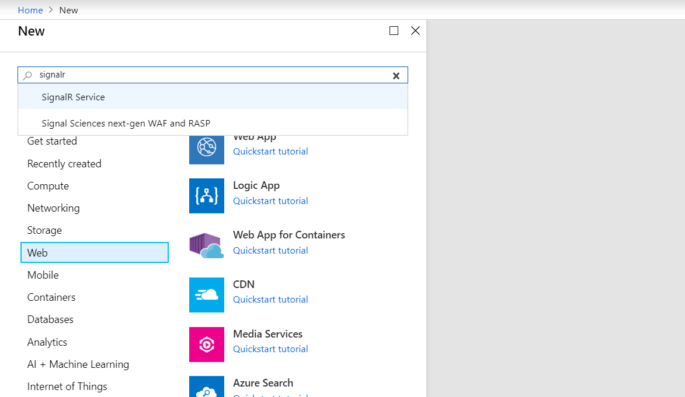
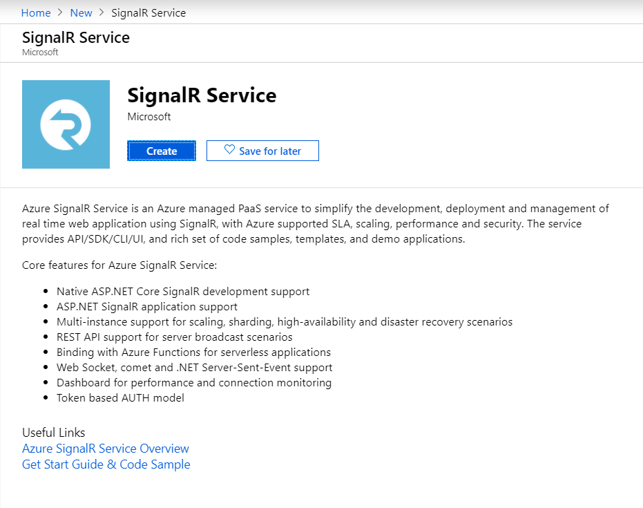
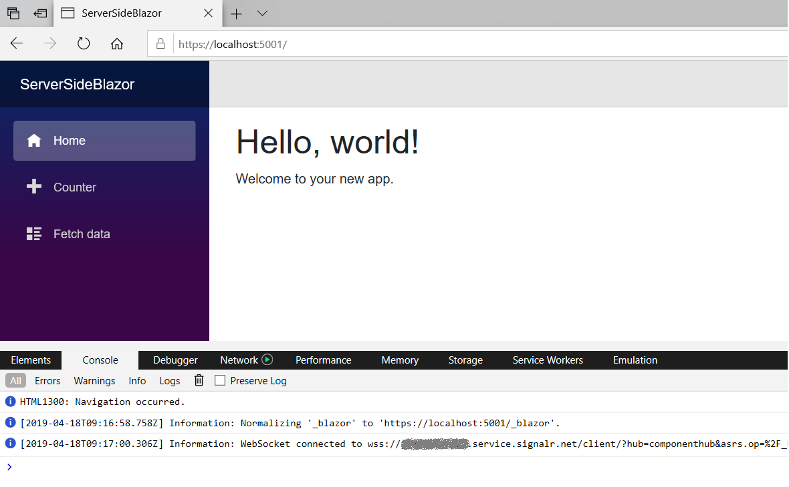

# Server-side Blazor with Azure SignalR Service

This sample is to show how to make Server-side Blazor work with Azure SignalR Service.

## Prerequisites
* Install .NET Core 3.0 SDK (Version >= 3.0.100-preview6-012264)

## Provision a SignalR Service

First let's provision a SignalR service on Azure. 
> If you don't have an Azure subscription, **[start now](https://azure.microsoft.com/en-us/free/)** to create a free account.

1. Open Azure portal, click "Create a resource" and search "SignalR Service".

   

2. Navigate to "SignalR Service" and click "Create".
   
   

3. Fill in basic information including resource name, resource group and location.

   

   Resource name will also be used as the DNS name of your service endpoint. So you'll get a `<resource_name>.service.signalr.net` that your application can connect to.

   Select a pricing tier. There're two pricing tiers:
   
   * Free: which can handle 20 connections at the same time and can send and receive 20,000 messages in a day.
   * Standard: which has 1000 concurrent connections and one million messages per day limit for *one unit*. You can scale up to 100 units for a single service instance and you'll be charged by the number of units you use.

4. Click "Create", your SignalR service will be created in a few minutes.

   

After your service is ready, go to the **Keys** page of your service instance and you'll get two connection strings that your application can use to connect to the service.

## Run the sample

Then let's update Server-side Blazor sample to use the new service you just created.

Set the connection string in the [Secret Manager](https://docs.microsoft.com/en-us/aspnet/core/security/app-secrets?view=aspnetcore-2.1&tabs=visual-studio#secret-manager) tool for .NET Core, and run this app.

```
dotnet restore
dotnet user-secrets set Azure:SignalR:ConnectionString "<your connection string>"
dotnet run
```

After running, you will see that the web server starts, makes connections to the Azure SignalR Service instance and creates an endpoint at `https://localhost:5001/`. Browser the page and click F12, you can find the connection to Azure SignalR Service is created. See snapshot 



> If you're blocked when visit the localhost endpoint related to `Not secure` or `This site can’t be reached`, it's caused by local cert is not trusted. Run command below to trust the dotnet built-in dev-certs before start the app.
> ```
> dotnet dev-certs https --trust
> ```

## Steps one by one

Let's take a look at each step about how to create this sample app.

1. Create Server-side Blazor project.

```
dotnet new blazorserverside 
```

2. Add reference to Azure SignalR SDK
   
```
dotnet add package Microsoft.Azure.SignalR --version 1.1.0-preview1-10384
```

3. Add a call to Azure SignalR Service in [Startup.cs](Startup.cs)
   
```cs
public void ConfigureServices(IServiceCollection services)
{
    ...
    services.AddServerSideBlazor().AddSignalR().AddAzureSignalR();
    ...
}
```

4. Configure Azure SignalR Service `ConnectionString` either in [appsetting.json](appsettings.json) or with [Secret Manager](https://docs.microsoft.com/en-us/aspnet/core/security/app-secrets?view=aspnetcore-2.1&tabs=visual-studio#secret-manager) tool

> Notes: Step 3 can be replaced by using hosting startup assemblies to SignalR SDK.
> 
> 1. Add configuration to turn on Azure SignalR Service in [appsetting.json](appsettings.json)
> ```js
>   "Azure": {
>     "SignalR": {
>       "Enabled": true,
>       "ConnectionString": <your-connection-string>
>     }
>   }
> ```
> 
> 2. Assign hosting startup assembly to use Azure SignalR SDK. Edit [launchSettings.json](Properties\launchSettings.json) and add a configuration like below inside `environmentVariables`.
> ```js
> "environmentVariables": {
>     ...,
>     "ASPNETCORE_HOSTINGSTARTUPASSEMBLIES": "Microsoft.Azure.SignalR"
>   }
> ```