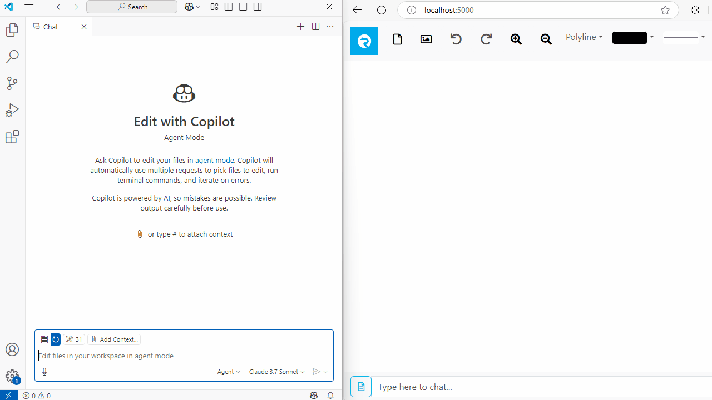

# Whiteboard: Real Time Collaboration using Azure SignalR Service

This is a sample project to demonstrate how to build a web application for real time collaboration using Azure, ASP.NET Core and other related technologies. This sample application includes the following features:

* A whiteboard that anyone can paint on it and others can see you paint in real time
* Painting features:
  1. Basic paint tools (freehand, line, rectangle, circle, ellipse) with customizable color and stroke thickness
  2. Upload a background image
  3. Pan and zoom canvas
  4. Undo and redo
  5. Touch support for mobile devices
* Real time chat

This application is based on the following technologies:

* For frontend: HTML5/javascript, bootstrap and vue.js
* For backend: ASP.NET Core
* For realtime communication: SignalR and Azure SignalR Service

## Build and run locally

1. Create an Azure SignalR Service instance
2. Go to Access control (IAM) tab on portal, add "SignalR App Server" role to your own Azure account
3. Set connection string
   ```
   set Azure__SignalR__ConnectionString=Endpoint=https://<resource_name>.service.signalr.net;Type=azure;
   ```
4. Make sure you log into Azure using Azure CLI
5. Build and run the application locally

   ```
   dotnet build
   dotnet run
   ```

> Alternatively you can also use access key based connection string to authenticate with Azure (which may be simpler but less secure than using Entra ID):
> 1. Go to portal and copy connection string from Connection strings tab
> 2. Save it to .NET secret store
>    ```
>    dotnet user-secrets set Azure:SignalR:ConnectionString "<your connection string>"
>    ```

Open multiple windows on http://localhost:5000/, when you paint in one window, others will see the update immediately.

## Deploy to Azure

1. To deploy the application to Azure Web App, first package it into a zip file:

   ```
   dotnet build
   dotnet publish -c Release
   ```
   Then package all files under `bin/Release/net9.0/publish` to a zip file.

2. Then use the following command to deploy it to Azure Web App:

   ```
   az webapp deployment source config-zip --src <path_to_zip_file> -n <app_name> -g <resource_group_name>
   ```

3. Set Azure SignalR Service connection string in the application settings. You can do it through portal or using Azure CLI:
   ```
   az webapp config appsettings set --resource-group <resource_group_name> --name <app_name> \
      --setting Azure__SignalR__ConnectionString="Endpoint=https://<resource_name>.service.signalr.net;Type=azure;"
   ```
   And add "SignalR App Server" role to your web app instance

   > You can also use access key based connection string but it's highly unrecommended

Now your whiteboard is running in Azure at `https://<app_name>.azurewebsites.net`. Enjoy!

## Interact with Large Language Model

[Model Context Protocol](https://github.com/modelcontextprotocol) (MCP) is an open protocol that enables seamless integration between LLM applications and external data sources and tools. With MCP we can expose the painting capability of whiteboard to LLM so it can draw the picture for you!



[MCPServer](MCPServer/) is a MCP server implementation that exposes hub methods from the whiteboard SignalR hub so LLM can directly operate on the whiteboard.

To install the MCP server:

1. Install dependencies

   ```
   npm install
   ```

2. The MCP server will by default connect to local server (http://localhost:5000). If your whiteboard is not running locally, set the endpoint in `WHITEBOARD_ENDPOINT` environment variable or `.env` file

3. Configure the MCP server in your LLM app (like Claude Desktop or GitHub Copilot in VS Code):

   ```json
   "mcpServers": {
     "Whiteboard": {
       "command": "node",
         "args": [
           "<path-to-MCPServer-project>/index.js"
         ]
      }
    }
   ```

   > Change `mcpServers` to `mcp` if you're using VS Code

4. Start the server if it's not automatically started (like in VS Code)

5. Now open your favorite LLM app and ask it to paint something on whiteboard, you'll see it paint in real time.