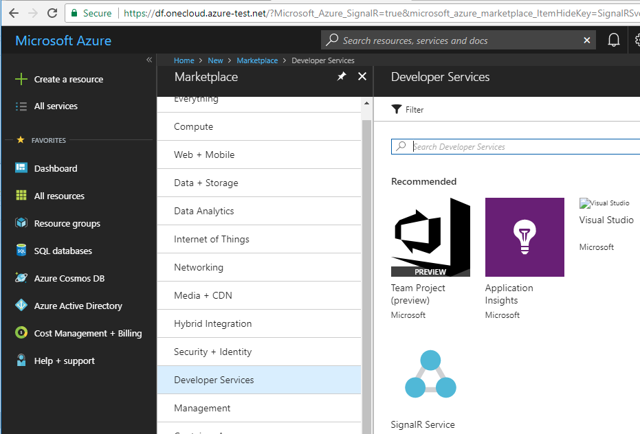
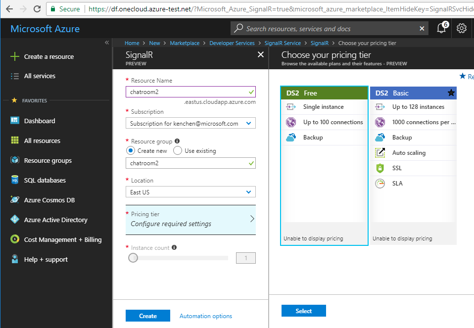
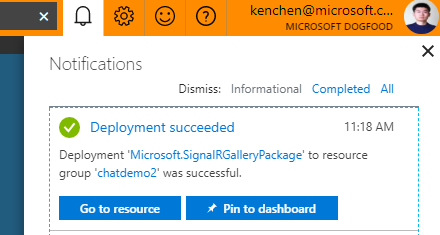

# Build Your First Azure SignalR Service Application

In last tutorial you have learned how to use SignalR Core to build a chat room application. In that example, the SignalR runtime (which manages the client connections and message routing) is running on your own server. As the number of the clients increases, you'll eventually hit a limit on your server and you'll need to scale your server to handle more clients. This is usually not an easy task. In this tutorial, you'll learn how to use Azure SignalR Service to offload the connection management part to the service so that you don't need to worry about the scaling problem.

## Create a SignalR Service

First let's create a SignalR service on Azure.

1. Open Azure portal, click "Create a resource" and find "SignalR Service" in "Web + Mobile".

   

2. Click "Create", and then fill in basic information including resource name, resource group and location.

   

   Resource name will also be used as the DNS name of your service endpoint. So you'll get a `<resource_name>.service.signalr.net` that your application can connect to.

   Select a pricing tier. There're two pricing tiers:
   
   * Free: which can handle 100 connections at the same time and can send and receive one million messages in a month.
   * Basic: which has 1000 concurrent connections and 75 millions message per month limit for *one unit*. You can scale up to 10 units for a single service instance and you'll be charged by the number of units you use.

   > In private preview, only basic tier with one unit is supported.

3. Click "Create", your SignalR service will be created in a few minutes.

   

After your service is ready, go to the Keys page of your service instance and you'll get two connection strings that your application can use to connect to the service.

The connection string is the form of the following:

```
Endpoint=<service_endpoint>;AccessKey=<access_key>;
```

## Update Chat Room to Use Azure SignalR Service

Then let's update the chat room sample to use the new service you just created.

The full sample code can be found [here](../samples/ChatRoom/). Let's look at the key changes:

1.  In [Startup.cs](../samples/ChatRoom/Startup.cs), instead of calling `AddSignalR()` and `UseSignalR()`, you need to call `AddAzureSignalR()` and `UseAzureSignalR()` and pass in connection string to make the application connect to the service instead of hosting SignalR by itself.

    ```cs
    public void ConfigureServices(IServiceCollection services)
    {
        ...
        services.AddAzureSignalR();
    }

    public void Configure(IApplicationBuilder app, IHostingEnvironment env)
    {
        ...
        app.UseAzureSignalR(Configuration[Constants.AzureSignalRConnectionStringKey],
            builder => 
            { 
                builder.UseHub<Chat>(); 
            });
    }
    ```

    You also need to reference the service SDK before using these APIs:

    ```xml
    <PackageReference Include="Microsoft.Azure.SignalR" Version="1.0.0-preview-10001" />
    ```

2.  Add an [AuthController.cs](../samples/ChatRoom/Controllers/AuthController.cs) that provides an API for authentication.

    The connection string is used for server code to connect to the service. For client, usually there are additional authentication needed, so Azure SignalR Service gives you the flexibility to implement your own authentication. A client doesn't directly connect to the service using connection string, instead your application need to implement an API that does the authentication and issues a token to the client. Client then use this token to connect to the service.

    In this sample, we simply do no authentication and directly issue the token. You can implement a real authentication in your own project.

    ```cs
    [HttpGet("{hubName}")]
    public IActionResult GenerateJwtBearer(string hubName, [FromQuery] string uid)
    {
        var serviceUrl = _endpointProvider.GetClientEndpoint(hubName);
        var accessToken =_tokenProvider.GenerateClientAccessToken(hubName, new[]
        {
            new Claim(ClaimTypes.NameIdentifier, uid)
        });
        return new OkObjectResult(new
        {
            ServiceUrl = serviceUrl,
            AccessToken = accessToken
        });
    }
    ```

    Here you can see there is `GenerateClientAccessToken()` in the service SDK that helps you issue the token from the connection string once you finish the authentication.

    Also besides the token, this API returns the service url so that the client knows where to connect.

3.  In [index.html](../samples/ChatRoom/wwwroot/index.html), change the logic to first call authentication API to get back the service url and token:

    ```js
    function getAccessToken(url) {
        return new Promise((resolve, reject) => {
            var xhr = new XMLHttpRequest();
            xhr.open('GET', url, true);
            xhr.setRequestHeader('X-Requested-With', 'XMLHttpRequest');
            xhr.send();
            xhr.onload = () => {
                if (xhr.status >= 200 && xhr.status < 300) {
                    resolve(JSON.parse(xhr.response || xhr.responseText));
                }
                else {
                    reject(new Error(xhr.statusText));
                }
            };

            xhr.onerror = () => {
                reject(new Error(xhr.statusText));
            }
        });
    }

    getAccessToken(`/api/signalr/chat?uid=${username}`)
        .then(function(endpoint) {
            accessToken = endpoint.accessToken;
            return startConnection(endpoint.serviceUrl, bindConnectionMessage);
        })
        .then(onConnected)
        .catch(onConnectionError);
    ```

    And then connect to service with the token:

    ```js
    var connection = new signalR.HubConnection(url, { transport: transport, accessToken: () => accessToken });
    ```

Other than these changes, everything else remains the same, you can still use the hub interface you're already familiar with to write business logic.

Now let's build and run the app (you need to first set connect string as an environment variable).

```
export AzureSignalRConnectionString="<connection_string>"
dotnet build
dotnet run
```

You can see the application runs as usual, just instead of hosting a SignalR runtime by itself, it connects to the SignalR service running on Azure.

In this tutorial you have learned how to use Azure SignalR Service to replace your self-hosted SignalR runtime. But you still need a web server to host your hub logic. In next tutorial you'll learn how to use other Azure services to host your hub logic so you can get everything running on cloud.
