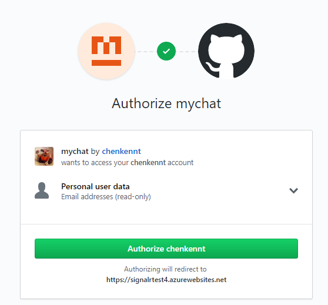

# Implement Your Own Authentication

The authentication in previous tutorial is actually very simple, you claim who you are and authentication API will give you a token with that name.
This is not really useful in real applications, in this tutorial you'll learn how to implement your own authentication and integrate with SignalR service.

GitHub provides OAuth APIs for third-party applications to authenticate with GitHub accounts. Let's use these APIs to allow users to login to our chat room with GitHub ID.

## Create an OAuth App

First step is to create a OAuth App in GitHub:

1. Go to GitHub -> Settings -> Developer Settings, and click "New OAuth App".
2. Fill in application name, description and homepage URL.
3. Authorization callback URL is the url GitHub will redirect you to after authentication. For now make it `http://localhost:5000/signin-github`.
4. Click "Register application" and you'll get an application with client ID and secret, you'll need them later when you implement the OAuth flow.

## Implement OAuth Flow

The first step of OAuth flow is to ask user to login with GitHub account. This can be done by redirect user to the GitHub login page.

Add a link in the chat room for user to login:

```js
appendMessage('_BROADCAST_', 'You\'re not logged in. Click <a href="/login">here</a> to login with GitHub.');
```

The link points to `/login` which redirects to GitHub OAuth page if you are not authenticated:

```cs
[HttpGet("login")]
public IActionResult Login()
{
    if (!HttpContext.User.Identity.IsAuthenticated)
    {
        return Challenge(GitHubAuthenticationDefaults.AuthenticationScheme);
    }

    HttpContext.Response.Cookies.Append("githubchat_username", HttpContext.User.Identity.Name);
    return Redirect("/");
}
```

GitHub will check whether you have already logged in and authorized the application, if not it will ask you to login and show a dialog to let you authorize the application:



After you authorized the application, GitHub will return a code to the application by redirecting to the callback url of the application. `AspNet.Security.OAuth.GitHub` package will handle the rest of the OAuth flow for us and redirect back to `/login` page with the authenticated user identity.

> For more details about GitHub OAuth flow, please refer to this [article](https://developer.github.com/v3/guides/basics-of-authentication/).

> For more details about using Cookie Authentication in ASP.NET Core, please refer to this [article](https://docs.microsoft.com/en-us/aspnet/core/security/authentication/cookie?view=aspnetcore-2.1&tabs=aspnetcore2x).

> The full sample code can be found [here](../samples/GitHubChat/).

## Update Hub Code

Then let's update the hub to enforce authentication.

1. Add `[Authorize]` attribute on the `Chat` class. Then only authenticated user can access the `/chat` endpoint. An `Unauthorized` error will be returned if user is not authenticated.
```cs
[Authorize]
public class Chat : Hub
{
    ...
}
```

2. In previous tutorial `BroadcastMessage()` method takes a `name` parameter to let caller claim who he is, which is apparently not secure.
Let's remove the `name` parameter and read user identifier from `Hub` class's `Context` member.:

```cs
public void BroadcastMessage(string message)
{
    Clients.All.SendAsync("broadcastMessage", Context.User.Identity.Name, message);
}
```

## Update Client Code

Finally let's update client code to handle `Unauthorized` error and instruct user to login.

```js
connection.start()
    .then(function () {
        onConnected(connection);
    })
    .catch(function (error) {
        console.error(error.message);
        if (error.message === "Unauthorized") {
            appendMessage('_BROADCAST_', 'You\'re not logged in. Click <a href="/api/auth/login">here</a> to login with GitHub.');
        }
    });
```

Now you can run the project to chat using your GitHub ID:

```
export Azure__SignalR__ConnectionString="<connection_string>"
export GitHubClientId=<client_id>
export GitHubClientSecret=<client_secret>
dotnet run
```

## Deploy to Azure

Deploy to Azure is same as before, just you need to set two new settings we just added:

```
az webapp config appsettings set --resource-group <resource_group_name> --name <app_name> \
   --setting GitHubClientId=<client_id>
az webapp config appsettings set --resource-group <resource_group_name> --name <app_name> \
   --setting GitHubClientSecret=<client_secret>
```

And change the callback url of your GitHub app from localhost to the actual Azure website.

## Customize Hub Method Authorization

It is possible to define different permission level on hub methods.
For example, we don't want everyone to be able to send message in chat room.
To achieve this we can define a custom authorization policy:

```cs
services.AddAuthorization(options =>
{
    options.AddPolicy("Microsoft_Only", policy => policy.RequireClaim("Company", "Microsoft"));
});
```

This policy requires user to have a "Microsoft" company claim.

Then apply the policy to `BroadcastMessage()` method:

```cs
[Authorize(Policy = "Microsoft_Only")]
public void BroadcastMessage(string message)
{
    ...
}
```

Now if your GitHub account's company is not Microsoft, you cannot send message in the chat room. But you can still see others' messages.

> If you use `send()` to call hub, SignalR won't send back a completion message so you won't know whether the call is succeeded or not.
> So if you want to get a confirmation of the hub invocation (for example in this case you want to know whether your call has enough permission) you need to use `invoke()`:
>
> ```js
> connection.invoke('broadcastMessage', messageInput.value)
>           .catch(e => appendMessage('_BROADCAST_', e.message));
> ```
